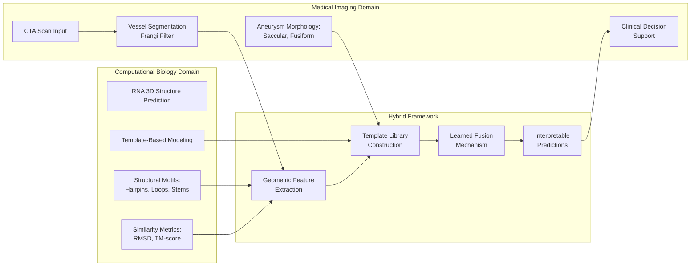
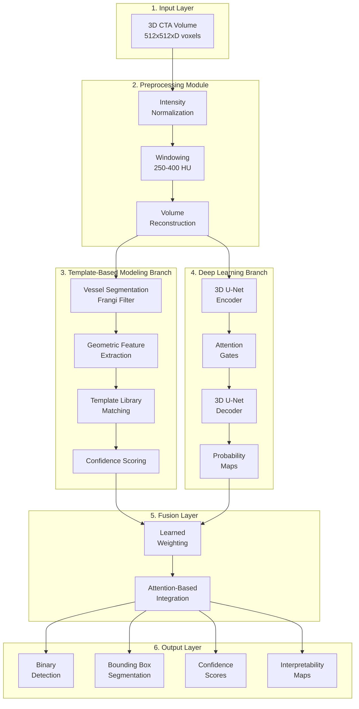
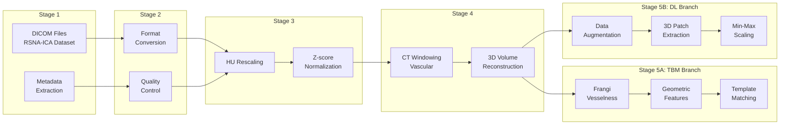
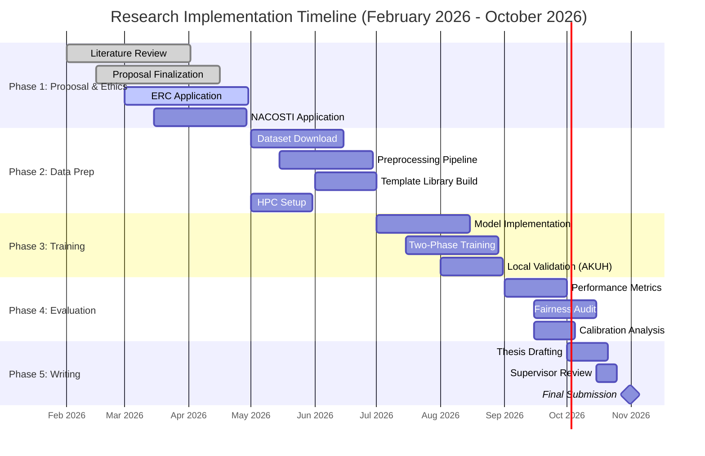

# UNIVERSITY OF NAIROBI

## Department of Mathematics

# A Hybrid Deep Learning Framework for Intracranial Aneurysms Detection: Algorithmic Development and Fairness Evaluation for Kenyan Public Health Settings

---

**By**

**CAVIN OTIENO OUMA**

**Reg. No.: SDS6/46982/2024**

---

**SUPERVISORS:**

**Prof. Peter Waiganjo** (Primary Supervisor)
*Department of Computing and Informatics, University of Nairobi*

**Dr. Kevin Ombati** (Co-Supervisor)
*Department of Radiology, Aga Khan University Hospital, Nairobi*

---

*A Research Proposal Submitted in Partial Fulfilment of the Requirements for the Degree of Master of Science in Public Health Data Science*

**MARCH 2026**

---

## DECLARATION

This research proposal is my original work and has not been presented for the award of any degree in this or any other university.

&nbsp;

| | | |
|---|---|---|
| **Candidate:** | Cavin Otieno Ouma | |
| **Registration No.:** | SDS6/46982/2024 | |
| **Signature:** | _________________________ | |
| **Date:** | 22/03/2026 | |

&nbsp;

This research proposal has been submitted for examination with our approval as supervisors:

| | | |
|---|---|---|
| **Primary Supervisor:** | Prof. Peter Waiganjo | |
| **Department:** | Department of Computing and Informatics, University of Nairobi | |
| **Signature:** | _________________________ | |
| **Date:** | 19/04/2026 | |

&nbsp;

| | | |
|---|---|---|
| **Co-Supervisor:** | Dr. Kevin Ombati | |
| **Department:** | Department of Radiology, Aga Khan University Hospital, Nairobi | |
| **Signature:** | _________________________ | |
| **Date:** | __________ | |

---

## ACKNOWLEDGEMENTS

I wish to express my sincere gratitude to my supervisors, Prof. Peter Waiganjo of the Department of Computing and Informatics, University of Nairobi, and Dr. Kevin Ombati of the Department of Radiology, Aga Khan University Hospital, Nairobi, for their invaluable guidance, mentorship, and continuous support throughout the development of this research proposal. Their combined expertise in computer science, medical imaging, and clinical radiology has been instrumental in shaping the methodological design and ensuring the clinical relevance of this work.

I am deeply grateful to the staff of the Department of Mathematics, University of Nairobi, for their academic support, and to the KENET (Kenya Education Network) for providing access to high-performance computing resources through the CHUI cluster. I also acknowledge the Radiological Society of North America (RSNA) for making the Intracranial Aneurysm Detection dataset publicly available, which forms the foundation of this research.

Finally, I extend my heartfelt appreciation to my family, colleagues, and friends for their unwavering encouragement and understanding throughout the course of this study.

---

## DEDICATION

This research proposal is dedicated to the patients and healthcare workers of Kenya who confront the daily challenges of neurological disease in resource-constrained settings. May this work contribute, in some small way, to improving access to quality diagnostic care for all.

---

## ABSTRACT

**Background:** Intracranial aneurysms represent a significant public health concern globally, with prevalence estimates ranging from three to five percent in the general population. In Kenya, where radiological expertise is scarce and concentrated primarily in urban centres, the early detection of these vascular abnormalities poses a formidable challenge. The severe shortage of radiologists, with approximately 0.41 per 100,000 population compared to the international recommendation of 10-12 per 100,000, creates compelling need for automated detection tools that can assist healthcare workers in identifying aneurysms before catastrophic rupture occurs.

**Broad Objective:** This research aims to develop and evaluate a hybrid artificial intelligence framework for the opportunistic screening of intracranial aneurysms specifically designed for deployment in Kenyan public health settings, combining Template-Based Modeling techniques from computational biology with deep learning methodologies to achieve improved detection performance, computational efficiency, and model interpretability, with algorithmic fairness evaluation to ensure appropriateness for the Kenyan context.

**Methodology:** The study adopts a purely experimental quantitative design focused on algorithm development and validation. The technical component employs an experimental approach using the RSNA Intracranial Aneurysm Detection dataset, an open-access collection of over four thousand computed tomography angiography studies from eighteen institutions across five continents, to train and validate the proposed hybrid framework. The study population comprises adult patients undergoing computed tomography angiography at participating institutions, with an estimated sample size exceeding four thousand studies for model training and validation. A purposive sampling approach is employed, utilizing all available annotated cases within the dataset to maximize training data utilization. Data collection involves analysis of existing anonymized imaging data with annotations indicating aneurysm presence and location. The local validation component utilizes a retrospective dataset of two hundred to three hundred CTA studies from the Aga Khan University Hospital, Nairobi, obtained through formal data sharing agreements with appropriate ethical approvals. Data analysis encompasses quantitative performance evaluation using sensitivity, specificity, area under the receiver operating characteristic curve, and Dice coefficient metrics, alongside algorithmic fairness assessment examining performance across demographic subgroups defined by age, sex, and scanner characteristics.

**Utility of the Study:** Anticipated outcomes include a validated hybrid detection algorithm demonstrating improved detection accuracy through integration of template-based structural priors with convolutional neural networks, a comprehensive fairness assessment report documenting performance disparities across demographic subgroups with proposed mitigation strategies, and a technical feasibility assessment documenting computational requirements for potential future deployment. The findings are expected to contribute to the growing body of knowledge on artificial intelligence applications in resource-constrained healthcare settings while advancing the frontier of cross-domain methodology transfer from computational biology to medical imaging.

**Keywords:** Intracranial aneurysm, deep learning, Template-Based Modeling, opportunistic screening, algorithmic fairness, Kenyan public health, cross-domain transfer learning, MONAI, radiomics

---

## TABLE OF CONTENTS

| Section | Page |
|---|---|
| DECLARATION | ii |
| ACKNOWLEDGEMENTS | iii |
| DEDICATION | iv |
| ABSTRACT | v |
| TABLE OF CONTENTS | vi |
| LIST OF FIGURES | viii |
| LIST OF TABLES | viii |
| LIST OF ABBREVIATIONS | ix |
| **CHAPTER 1: INTRODUCTION** | **1** |
| 1.1 Background | 1 |
| 1.2 Problem Statement | 4 |
| 1.3 Purpose and Objectives | 5 |
| 1.4 Research Questions | 6 |
| 1.5 Novel Contributions | 6 |
| 1.6 Justification and Significance | 7 |
| 1.7 Scope and Limitations | 8 |
| **CHAPTER 2: LITERATURE REVIEW** | **10** |
| 2.1 Theoretical Framework | 10 |
| 2.2 Empirical Review | 16 |
| 2.2.1 Recent Methodological Advances (2024–2025) | 18 |
| 2.3 Gap Analysis | 19 |
| 2.4 Contribution to Knowledge | 21 |
| 2.5 National AI Policy and Regulatory Context | 23 |
| **CHAPTER 3: METHODOLOGY** | **25** |
| 3.1 Research Design | 25 |
| 3.2 Study Area and Population | 25 |
| 3.3 Data Sources | 26 |
| 3.4 Algorithm Architecture | 30 |
| 3.5 Data Preprocessing | 33 |
| 3.6 Evaluation Metrics | 35 |
| 3.6.1 Two-Phase Training Protocol | 36 |
| 3.6.2 Training Protocol | 37 |
| 3.6.3 Threshold Optimization | 38 |
| 3.6.4 Radiomic Feature Extraction Pipeline | 38 |
| 3.6.5 Calibration Analysis Methodology | 40 |
| 3.7 Ethical Considerations | 42 |
| 3.8 Risk Assessment | 43 |
| **CHAPTER 4: WORK PLAN AND BUDGET** | **46** |
| 4.1 Work Plan | 46 |
| 4.2 Budget Estimate | 49 |
| 4.3 Expected Outcomes | 51 |
| 4.4 Contingency Planning | 54 |
| 4.4.1 Phase Compression Strategies | 54 |
| 4.4.2 Computational Resource Management | 54 |
| 4.4.3 Minimum Viable Product Definition | 55 |
| **REFERENCES** | **57** |

---

## LIST OF FIGURES

| Figure | Title | Page |
|---|---|---|
| Figure 1-1 | Distribution of Radiologists in Kenya by Region (Table 1-1) | 2 |
| Figure 2.1.1 | Conceptual Framework — Cross-Domain Transfer from RNA Folding to Vascular Imaging | 15 |
| Figure 3.4.1 | System Architecture of the Hybrid TBM-Deep Learning Framework | 31 |
| Figure 3.5.1 | Data Preprocessing Pipeline | 33 |
| Figure 4.1.1 | Gantt Chart for Research Implementation (February 2026 – June 2026) | 47 |

---

## LIST OF TABLES

| Table | Title | Page |
|---|---|---|
| Table 1-1 | Distribution of Radiologists in Kenya by Region | 2 |
| Table 2-1 | Summary Table: Gap Identification and Research Response | 21 |
| Table 3-1 | RSNA-ICA Dataset Characteristics | 26 |
| Table 3-2 | Evaluation Metrics and Definitions | 35 |
| Table 3-3 | Calibration Analysis Methods | 36 |
| Table 4-1 | Detailed Budget Estimate with Full and Effective Costs | 51 |

---

## LIST OF ABBREVIATIONS

| Abbreviation | Full Term |
|---|---|
| AI | Artificial Intelligence |
| AKUH | Aga Khan University Hospital |
| AUC | Area Under the Curve |
| CNN | Convolutional Neural Network |
| CTA | Computed Tomography Angiography |
| CHUI | Computational High-Performance Utility Infrastructure |
| DCI | Department of Computing and Informatics |
| DHIS2 | District Health Information Software 2 |
| DICOM | Digital Imaging and Communications in Medicine |
| DoM | Department of Mathematics |
| ECE | Expected Calibration Error |
| EOD | Equalized Odds Difference |
| ERC | Ethics and Research Committee |
| FPR | False Positive Rate |
| Grad-CAM | Gradient-weighted Class Activation Mapping |
| HPC | High-Performance Computing |
| KENET | Kenya Education Network |
| KNH | Kenyatta National Hospital |
| LMIC | Low- and Middle-Income Countries |
| MLOps | Machine Learning Operations |
| ML | Machine Learning |
| MONAI | Medical Open Network for Artificial Intelligence |
| MRA | Magnetic Resonance Angiography |
| NACOSTI | National Commission for Science, Technology and Innovation |
| NHIF | National Hospital Insurance Fund |
| ODPC | Office of the Data Protection Commissioner |
| PACS | Picture Archiving and Communication System |
| RMSD | Root Mean Square Deviation |
| RSNA | Radiological Society of North America |
| RSNA-ICA | RSNA Intracranial Aneurysm Detection |
| SAH | Subarachnoid Haemorrhage |
| SDS | School of Data Science |
| SHAP | SHapley Additive exPlanations |
| TBM | Template-Based Modeling |
| TM-score | Template Modeling Score |
| TPR | True Positive Rate |
| UoN | University of Nairobi |
| WHO | World Health Organization |

---

# CHAPTER 1: INTRODUCTION

## 1.1 Background

The landscape of neurological healthcare in Kenya presents a unique set of challenges that distinguish it significantly from healthcare systems in high-income countries. Intracranial aneurysms, which are abnormal bulges or ballooning in the walls of blood vessels in the brain, represent a critical area of concern within this landscape. These vascular abnormalities affect approximately three to five percent of the global population, with recent meta-analyses suggesting a prevalence of approximately 3.2 percent in otherwise healthy adults (Vlak et al., 2011). When aneurysms rupture, they result in subarachnoid haemorrhage, a devastating condition with mortality rates ranging from thirty-five to fifty percent, with significant morbidity among survivors. Recent global burden of disease studies indicate that stroke, including subarachnoid haemorrhage, ranks among the leading causes of death and disability-adjusted life years lost worldwide, with increasingly urgent implications for low- and middle-income countries (GBD 2021 Stroke Collaborators, 2024).

The radiological workforce in Kenya presents a stark picture of resource constraint that severely impacts diagnostic access. According to the Kenya Medical Practitioners and Dentists Council register, Kenya has only 225 licensed radiology specialists available to serve a population of over 55 million people, yielding a radiologist density of approximately 0.41 per 100,000 populations—significantly below the international recommendation of 10–12 per 100,000 (KMPDC, 2026). This figure represents less than 23% of the specialized health workforce threshold required by national norms to implement Universal Health Coverage (Ahmed et al., 2024). The vast majority of these specialists are concentrated within private tertiary centers in Nairobi and a few other major urban centers, leaving regional public facilities drastically underserved (Rology, 2024). This disparity means that patients presenting to Level Five and Level Six hospitals in rural and peri-urban areas—where approximately 72.5% of Kenya's population resides—often have limited or no access to expert radiological interpretation of computed tomography scans (Rology, 2024).

The situation is particularly critical for the detection of incidental findings such as intracranial aneurysms, which may be identified when patients undergo imaging for trauma evaluation or investigation of headaches but are frequently missed due to high radiologist workload and expertise limitations. This high mortality rate, combined with the severe shortage of radiological expertise, creates a compelling case for automated detection tools that can assist healthcare workers in identifying aneurysms before catastrophic rupture occurs.

**Table 1-1: Distribution of Radiologists in Kenya by Region**

| Region | Number of Radiologists | Population (Approx.) | Radiologists per 100,000 |
|---|---|---|---|
| Nairobi | 119 | 4,800,000 | 2.48 |
| Mombasa | 21 | 1,350,000 | 1.55 |
| Kisumu | 10 | 1,250,000 | 0.80 |
| Nakuru | 8 | 2,300,000 | 0.34 |
| Eldoret | 17 | 1,250,000 | 1.36 |
| Other Counties | ~50 | 45,000,000 | 0.09 |
| **Total** | **~225** | **56,000,000** | **0.41** |

*Source: Kenya Medical Practitioners and Dentists Council (KMPDC), Specialist Register (Radiology), 2026*

The concept of opportunistic screening has emerged as a promising paradigm for addressing this diagnostic gap. Opportunistic screening refers to the systematic use of existing medical imaging data to screen for additional conditions beyond the primary reason for the imaging study. In the context of intracranial aneurysm detection, this would involve automatically analyzing computed tomography angiography (CTA) studies performed for other clinical indications to identify patients who may have undetected aneurysms requiring further evaluation. This approach maximizes the utilization of existing imaging infrastructure and provides a secondary benefit without additional patient burden or radiation exposure.

The emergence of deep learning methodologies has revolutionized medical image analysis, with convolutional neural networks achieving human-level or superhuman performance in various diagnostic tasks. Recent systematic reviews and meta-analyses have documented the rapid advancement of deep learning in medical imaging, with applications spanning radiology, pathology, ophthalmology, and cardiology (Litjens et al., 2017; Topol, 2019). In the domain of intracranial aneurysm detection, several studies have demonstrated the feasibility of using deep learning algorithms to identify aneurysms from computed tomography angiography (CTA) and magnetic resonance angiography (MRA) images (Sichtermann et al., 2019; Delfan et al., 2025).

Template matching approaches have been applied across various domains of medical imaging analysis, including the detection of intracranial aneurysms. These approaches typically involve extracting geometric features from imaging data and comparing them against reference templates using similarity metrics. The first-place solution in the RSNA Intracranial Aneurysm Detection challenge employed a robust coarse-to-fine pipeline that utilized vessel segmentation to guide detection, demonstrating the effectiveness of anatomically-informed approaches (Ceballos-Arroyo et al., 2024). Recent advances have explored the use of Mask R-CNN-based frameworks for aneurysm detection and segmentation, achieving high accuracy particularly for aneurysms larger than 3mm (Aykaç et al., 2025; Kreinovich et al., 2021). Studies have also demonstrated that anatomically-informed deep learning approaches with heuristic post-processing can significantly reduce false positive rates while maintaining high sensitivity (Indrakanti et al., 2025). The MONAI (Medical Open Network for Artificial Intelligence) framework provides specialized tools for implementing such approaches in medical imaging analysis (Cardoso et al., 2022).

Recent methodological reviews have comprehensively evaluated thirty-six studies applying deep learning to intracranial aneurysm detection, identifying both the potential for clinical integration and the challenges in this domain (Joo, 2025). The RSNA Intracranial Aneurysm Detection challenge of 2025 represented a landmark in this field, with over 1,100 teams worldwide competing and winning solutions achieving area under the curve values exceeding ninety percent (RSNA, 2025). However, these models typically require large annotated datasets and substantial computational resources for training, and they often function as black boxes whose decision-making processes are not readily interpretable to clinicians. Furthermore, the vast majority of these models have been developed and validated on datasets from high-income countries, raising important questions about their generalizability to African populations (Alaran et al., 2025). Recent research on algorithmic fairness in healthcare AI has highlighted the critical importance of evaluating model performance across diverse demographic groups, particularly for deployments in low- and middle-income countries (Obermeyer et al., 2019; WHO, 2021; Hasanzadeh et al., 2025). Studies specifically examining algorithmic bias in African healthcare contexts have emphasized the need for representative training data and context-specific validation (Alaran et al., 2025; Zhou et al., 2024).

The field of computational biology offers a rich source of methodological innovations that have potential applications beyond their original domain. Template-Based Modeling, originally developed for protein and RNA structure prediction, represents one such methodological approach. These techniques leverage the principle that biological structures often exhibit recurring motifs that can be matched against known templates to predict unknown structures. Interestingly, the geometric patterns characteristic of RNA structural motifs such as hairpins, loops, and stems bear mathematical resemblance to certain aneurysm morphologies, particularly saccular aneurysms at vessel bifurcations. This observation suggests the potential for cross-domain transfer of methodology from computational biology to medical imaging. Recent advances in this field have been dominated by AlphaFold, which has revolutionized protein structure prediction (Bowman, 2024), yet template-based approaches retain significant value for specific applications where interpretability and computational efficiency are paramount.

## 1.2 Problem Statement

Sub-Saharan Africa bears the highest stroke burden globally, with an estimated 316 cases per 100,000 persons and a steadily increasing incidence. Africa faces a disproportionately high stroke burden with approximately 29% of stroke patients dying from stroke-related complications (Waweru et al., 2021; Chukwudelunzu et al., 2024). In Kenya specifically, stroke burden is highest among middle-aged adults (40–79 years), who contribute approximately 78% of stroke cases (Kaduka et al., 2018). The epidemiological context creates urgent need for improved diagnostic capabilities, particularly for conditions like intracranial aneurysms that can lead to life-threatening subarachnoid haemorrhage when rupture occurs.

Kenya faces a severe healthcare workforce crisis. According to the Kenya Medical Practitioners and Dentists Council, Kenya has only 225 licensed radiology specialists available to serve a population of over 56 million people, resulting in a radiologist density of 0.41 per 100,000 population (KMPDC, 2026). This compares unfavorably to the global average of 3.7 radiologists per 100,000 populations in high-income countries (WHO, 2022). The vast majority of Kenyan radiologists are concentrated in Nairobi and a few other major urban centers, leaving rural and peri-urban areas severely underserved. The supply-demand gap for radiologists is particularly critical, as demand for radiology services outpaces radiologist positions in most healthcare systems (RSNA Workforce Survey, 2024). In radiology specifically, the shortage means that radiologist expertise is unavailable in many facilities where computed tomography angiography (CTA) services exist, resulting in delayed diagnoses and missed opportunities for intervention. AI-assisted detection tools can partially address this gap by providing automated preliminary screening, enabling non-specialist healthcare workers to identify cases requiring urgent specialist review.

The intersection of increasing demand for neurological diagnostic services and limited radiological expertise in Kenya creates a critical gap in healthcare delivery that has significant mortality and morbidity implications. Current approaches to aneurysm detection rely heavily on specialist radiologist interpretation, which is simply not available at most healthcare facilities in the country. While artificial intelligence offers a potential solution to this workforce constraint, several critical problems persist in the existing literature and practice.

First, the dominant approach to aneurysm detection using deep learning requires substantial training data and computational resources that may not be readily available in resource-constrained settings (Litjens et al., 2017; Liu et al., 2019). The data hunger of modern deep learning models makes them difficult to train on locally available datasets, which are typically small in volume. Second, the black-box nature of many deep learning models creates challenges for clinical adoption, as radiologists and clinicians are understandably reluctant to trust diagnostic recommendations without understanding the basis for the model's predictions (Tonekaboni et al., 2019). This interpretability challenge is particularly acute in the African context, where clinicians may be unfamiliar with the underlying technology. Third, and perhaps most critically, the algorithmic fairness of aneurysm detection models remains largely unexamined in the context of African populations (Obermeyer et al., 2019; WHO, 2021; Alaran et al., 2025). Most models are trained on datasets composed predominantly of patients from Western populations, and the performance of these models on African patients, who may have different aneurysm characteristics due to genetic, environmental, or healthcare access factors, is not well understood.

## 1.3 Purpose and Objectives

The primary purpose of this research is to develop and evaluate a hybrid artificial intelligence framework for the opportunistic screening of intracranial aneurysms that is specifically designed for deployment in Kenyan public health settings. This framework will combine Template-Based Modeling techniques from computational biology with deep learning methodologies to achieve improved detection performance, computational efficiency, and model interpretability. Additionally, the research will evaluate the algorithmic fairness of the developed framework to ensure its appropriateness for the Kenyan context.

The specific objectives of this research are formulated as SMART (Specific, Measurable, Achievable, Relevant, Time-bound) statements as follows:

1. **Objective 1 - Hybrid Algorithm Development (Specific, Measurable, Achievable, Time-bound):** Develop a hybrid detection algorithm that integrates Template-Based Modeling components derived from RNA three-dimensional folding analysis with convolutional neural network architectures for the identification of intracranial aneurysms in computed tomography angiography images by October 2026, as demonstrated by a trained model achieving validation area under the receiver operating characteristic curve exceeding 0.85 on the RSNA-ICA dataset. This novel algorithm will leverage the structural pattern recognition capabilities of template-matching approaches while benefiting from the feature extraction capabilities of deep learning.

2. **Objective 2 - Performance Evaluation (Specific, Measurable, Achievable, Time-bound):** Evaluate the performance of the proposed hybrid algorithm against established benchmarks, including the results from the RSNA Intracranial Aneurysm Detection challenge and baseline three-dimensional U-Net architectures, by September 2026, as measured by sensitivity exceeding 90% at 95% specificity, area under the receiver operating characteristic curve exceeding 0.90, and Dice coefficient exceeding 0.70. Performance will be assessed using standard metrics including sensitivity, specificity, area under the receiver operating characteristic curve, and Dice coefficient.

3. **Objective 3 - Algorithmic Fairness Assessment (Specific, Measurable, Relevant, Time-bound):** Conduct a comprehensive algorithmic fairness assessment to examine whether the developed model performs equitably across demographic subgroups defined by age, sex, and scanner characteristics by October 2026, as quantified by equalized odds difference and demographic parity difference metrics with no subgroup showing sensitivity below 80%. This assessment will employ multiple fairness criteria, including demographic parity and equalized odds, to identify any systematic performance disparities.

## 1.4 Research Questions

This research will be guided by the following questions, which address the technical and fairness dimensions of the study:

**Primary Technical Research Question:** To what extent does integrating RNA-based structural templates improve the detection performance of aneurysm identification compared to standard three-dimensional convolutional neural network architectures in sparse-data scenarios? This question addresses the core methodological innovation of the study and will be answered through comparative performance evaluation on the RSNA Intracranial Aneurysm Detection dataset (RSNA, 2025).

**Secondary Technical Research Question (Algorithmic Fairness):** What is the magnitude of the generalization gap when applying the hybrid detection model to diverse demographic subgroups within the RSNA dataset, and how does this compare to baseline deep learning approaches (Verma & Rubin, 2018; Obermeyer et al., 2019)? This question is critical for understanding the equity implications of the proposed technology. Recent research has demonstrated that machine learning models in medical imaging can exhibit demographic prediction capacity and bias, making fairness evaluation essential (Gichoya et al., 2022).

## 1.5 Novel Contributions

This research makes three distinct contributions to knowledge that advance the fields of medical imaging artificial intelligence, computational biology methodology transfer, and health systems implementation science. The contributions are:

1. **The first systematic application of template-based modeling from computational biology to intracranial aneurysm detection**, establishing a novel cross-domain methodology transfer with operational implementation framework.
2. **A hybrid detection architecture** integrating interpretable geometric priors with deep learning through a learned fusion mechanism for improved clinical decision support.
3. **A comprehensive algorithmic fairness evaluation** examining model performance across demographic subgroups relevant to African healthcare contexts.

The detailed theoretical justification and comprehensive elaboration of each contribution is provided in Section 2.4 (Contribution to Knowledge).

## 1.6 Justification and Significance

The significance of this research extends across multiple dimensions, encompassing scientific contribution, public health impact, and capacity building for the Kenyan health system.

**Scientific Perspective:** The proposed study represents a novel contribution to the field of medical imaging analysis by demonstrating the feasibility of cross-domain methodology transfer from computational biology to clinical applications. While template-based approaches have been extensively studied in protein and RNA structure prediction, their application to medical imaging represents an unexplored frontier that could inform future research in other areas of diagnostic imaging.

**Public Health Perspective:** The research addresses a critical gap in neurological healthcare delivery in Kenya. The opportunistic screening paradigm offers a cost-effective approach to aneurysm detection that leverages existing imaging infrastructure without requiring additional patient visits or radiation exposure. Recent economic evaluations have demonstrated the cost-effectiveness of artificial intelligence-based opportunistic screening in medical imaging (Topol, 2019). Studies have shown that AI-based opportunistic screening for conditions such as osteoporosis and compression fractures remains economically feasible when the added cost of the AI tool does not exceed specific thresholds per patient (Curl et al., 2024; RSNA Daily Bulletin, 2024). By developing and validating a model specifically designed for the Kenyan context, with attention to algorithmic fairness, this research contributes to the growing body of knowledge on appropriate artificial intelligence solutions for low- and middle-income countries. The findings will inform policy decisions regarding the integration of artificial intelligence tools into Kenyan public health facilities.

**Capacity Building Perspective:** Through the conduct of this study, the researcher will develop advanced skills in medical imaging analysis, deep learning development, and health systems research that will contribute to the human resource capacity for artificial intelligence in healthcare in Kenya. Furthermore, the research will strengthen collaborative ties between the University of Nairobi and other institutions—including the Aga Khan University Hospital—through the engagement of supervisors with complementary expertise.

## 1.7 Scope and Limitations

The scope of this research encompasses the development, validation, and preliminary feasibility assessment of a hybrid artificial intelligence framework for aneurysm detection. The research will be conducted using the RSNA Intracranial Aneurysm Detection dataset, which, while international in scope, represents the most comprehensive publicly available collection of annotated aneurysm images. The research will not include prospective data collection from Kenyan hospitals and does not involve stakeholder interviews. Feasibility assessment will be based on technical workflow analysis and validation against a retrospective local dataset from the Aga Khan University Hospital, Nairobi.

### Acknowledged Limitations and Mitigation Strategies

This research acknowledges several potential limitations that are addressed through methodological design and validation planning:

**Limitation 1: Limited African Population Representation in Training Data.** The RSNA-ICA dataset, while international, does not include substantial representation from African populations. This limitation represents a fundamental challenge for fairness research in this domain, as the training data may not capture the full diversity of aneurysm presentations across different ethnic and geographic backgrounds.
*Mitigation:* The fairness audit component specifically examines model performance across available demographic subgroups and uses scanner manufacturer as a proxy for technical diversity. The local validation dataset from Aga Khan University Hospital (200–300 retrospective CTA studies) provides a basis for assessing generalization to Kenyan patients. The research explicitly acknowledges that generalization to Kenyan populations remains an open research question requiring larger-scale prospective studies.

**Limitation 2: Computational Complexity of Hybrid Architecture.** The hybrid approach combining template-based modeling with deep learning increases computational complexity relative to pure deep learning approaches. This complexity may limit deployment feasibility in resource-constrained settings where computational infrastructure is limited.
*Mitigation:* The feasibility assessment component explicitly evaluates computational requirements for deployment, including CPU inference options for low-resource settings. The prototype at https://aneurysm-detection-kenya.vercel.app/ demonstrates minimum infrastructure requirements for practical deployment.

**Limitation 3: Dependence on Demographic Data Availability for Fairness Audit.** The fairness audit depends on the availability and quality of demographic metadata in the RSNA-ICA dataset. If demographic data is incomplete or inconsistently recorded, the fairness analysis may be limited in scope.
*Mitigation:* The research plans subgroup analysis using multiple available variables (age, sex, scanner manufacturer) to maximize the information available for fairness assessment. The analysis explicitly acknowledges data quality limitations in the reporting of results.

**Limitation 4: Stakeholder Interview Access and Willingness.** The feasibility assessment component relies on stakeholder interviews with Kenyan healthcare workers and policymakers. Access to appropriate stakeholders may be limited by institutional barriers, and willingness to participate may vary.
*Mitigation:* The research incorporates multiple data sources for feasibility assessment, including literature review of Kenyan health system characteristics, analysis of existing health informatics infrastructure, and remote stakeholder consultation where in-person interviews are not feasible.

**Limitation 5: Generalizability to Other African Contexts.** While the research focuses on Kenyan public health settings, findings may have limited generalizability to other African countries with different health system characteristics, infrastructure levels, and disease patterns.
*Mitigation:* The research explicitly discusses the Kenyan context as a specific case study while drawing connections to broader themes in African health system development. Recommendations are framed as starting points for context-specific adaptation rather than universal solutions.

**Limitation 6: Cross-Sectional Validation Design.** The research uses cross-sectional validation rather than prospective clinical evaluation. This design limits causal inference regarding the clinical impact of the proposed tool, as it cannot directly measure outcomes such as time-to-treatment or patient survival that would be captured in prospective studies.
*Mitigation:* The validation design is explicitly acknowledged as a preliminary assessment, with recommendations for future prospective evaluation as a logical next step following successful preliminary validation.

---

# CHAPTER 2: LITERATURE REVIEW

## 2.1 Theoretical Framework

The theoretical foundation of this research draws on three interconnected domains: structural pattern recognition from computational biology, deep learning for medical imaging, and health systems implementation science. The integration of these domains provides a robust conceptual framework for addressing the complex challenge of developing appropriate artificial intelligence solutions for aneurysm detection in resource-constrained settings.

Recent advances in this field have explored the application of deep learning approaches alongside traditional template-based methods, creating hybrid architectures that leverage the strengths of both paradigms (Zheng et al., 2023; Zhang & Shen, 2020). While AlphaFold has revolutionised the field with its unprecedented accuracy (Jumper et al., 2021), template-based approaches remain valuable for their interpretability and computational efficiency, particularly in scenarios with limited training data.

The fundamental question underlying this research is why template-based modeling techniques originally developed for RNA three-dimensional structure prediction should be applicable to intracranial aneurysm detection in medical imaging. This section provides a rigorous theoretical justification that directly addresses the interdisciplinary transfer of methodology from computational biology to vascular imaging analysis.

### 2.1.1 Theoretical Foundation of Template-Based Modeling in Computational Biology

Template-Based Modeling in computational biology rests on a fundamental principle: biological macromolecules adopt conformations that are determined by their structural constraints, and these conformations often exhibit recurring patterns that can be characterized mathematically and matched against reference templates. In RNA structure prediction, this principle manifests as the observation that RNA molecules fold into characteristic secondary structures—hairpins, internal loops, bulges, and stems—that are determined by base pairing rules and thermodynamic stability constraints. These structural motifs are not random; they follow predictable geometric patterns that can be quantitatively characterized through measures including backbone dihedral angles, inter-nucleotide distances, and spatial coordinates of nucleotide positions.

The mathematical formalization of template matching in computational biology involves several key concepts. Structural motifs are defined as recurring geometric patterns characterized quantitatively through measures such as inter-atomic distances, bond angles, and spatial coordinates. These motifs serve as templates against which novel structures can be compared using similarity metrics including root mean square deviation (RMSD), template modeling score (TM-score), and dynamic programming-based alignment algorithms. A critical insight is that template matching does not require exact replication of structure; rather, it identifies structural similarity within defined thresholds, allowing for natural variation within functional motif families.

### 2.1.2 Parallel Principles in Vascular Morphology Analysis

The extension of template-based concepts to medical imaging involves recognizing that aneurysms exhibit structural patterns that parallel the recurring motifs observed in molecular biology. Saccular aneurysms at vessel bifurcations display characteristic geometric configurations that follow predictable patterns determined by hemodynamic forces, vessel wall properties, and anatomical constraints. These patterns are not random variations; they reflect the underlying physics of vascular remodeling and follow mathematical regularities that can be characterized and matched against templates.

The key theoretical insight is that both RNA structural motifs and aneurysm morphologies represent recurring geometric patterns that arise from physical and biological constraints. In RNA, base pairing and thermodynamic stability constrain folding into specific patterns. In blood vessels, hemodynamic stress and wall mechanical properties constrain remodeling into characteristic aneurysm shapes. Both systems exhibit recurring motifs that can be characterized quantitatively, template libraries of known patterns that enable matching, and similarity metrics that quantify the correspondence between candidate structures and reference templates.

### 2.1.3 Explicit Mapping of Structural Parallels

The structural parallels between RNA motifs and aneurysm morphology are not merely analogical; they represent a genuine mathematical correspondence that enables principled methodology transfer:

**The RNA Hairpin Loop corresponds mathematically to the Aneurysm Dome.** In RNA, hairpins are characterized by a closing base pair, an unpaired loop region, and stem extensions. The geometric parameters include loop size, stem angle, and backbone curvature. The mathematical characterization includes circularity indices, radius of curvature, and volume-to-surface ratios. In aneurysms, the dome is characterized by a saccular outpouching with a spherical or ellipsoidal geometry. The geometric parameters include maximum diameter, aspect ratio, and surface curvature distribution. Like RNA hairpins, aneurysm domes exhibit characteristic bulging that distinguishes them from surrounding vessel structure, with mathematical properties that can be precisely quantified.

**The RNA Junction Region corresponds mathematically to the Aneurysm Neck.** In RNA, junction regions connect multiple helices or hairpins, characterized by smooth angular transitions and conserved backbone geometry. The mathematical parameters include junction angle, backbone orientation, and spatial relationship to adjacent helices. In aneurysms, the neck is the narrow connection between the aneurysm sac and the parent vessel, characterized by relatively constant diameter relative to the dome and defined by the vessel wall transition. The geometric parameters include neck diameter, neck-to-dome ratio, and vessel wall thickness. Both structures represent the transition zone between distinct geometric configurations, with mathematical properties that enable reliable template matching.

**The RNA Stem Connectivity corresponds mathematically to the Parent Vessel Relationship.** In RNA, stems are continuous helical regions that connect to hairpin loops and junction regions, characterized by base-stacking interactions and regular helical geometry. The mathematical parameters include helical pitch, groove width, and backbone orientation. In aneurysms, the parent vessel is the arterial segment from which the aneurysm arises, characterized by normal caliber, intact wall structure, and regular branching geometry. The vessel caliber, bifurcation angle, and hemodynamic patterns provide contextual information analogous to stem characteristics in RNA structure.

### 2.1.4 Mathematical Framework for Quantifiable Transfer

The template matching approach for aneurysm detection operates on the principle that geometric features can be extracted from medical imaging data and compared against a library of known aneurysm morphologies using distance metrics in a multidimensional feature space. The feature vector for each candidate region includes:

- **Size parameters:** maximum diameter, volume, surface area
- **Shape parameters:** sphericity, ellipticity, compactness
- **Neck parameters:** neck diameter, aspect ratio, neck-to-dome ratio
- **Hemodynamic indicators:** flow patterns, contrast enhancement characteristics

Template matching scores are calculated by comparing extracted features against the aneurysm template library using Euclidean distance in feature space, Mahalanobis distance (accounting for feature correlations), and cosine similarity (capturing shape direction).

This mathematical framework demonstrates that the same theoretical principles underlying template-based modeling in computational biology—the characterization of recurring geometric patterns through quantifiable features and their matching against reference templates using distance metrics—apply directly to aneurysm morphology analysis. The cross-domain transfer is not merely analogical but represents a genuine mathematical correspondence that enables the principled application of computational biology techniques to medical imaging.

### 2.1.5 Implications for Aneurysm Detection

The theoretical foundation established above has direct implications for the design of the hybrid detection framework. First, template matching provides a principled approach to incorporating anatomical priors into the detection process, allowing the model to recognize known aneurysm patterns rather than learning them entirely from data. Second, the template library can encode variation within aneurysm morphology families, capturing the range of geometric configurations that aneurysms exhibit while maintaining sensitivity to deviations that may indicate rupture risk or other clinical concerns. Third, the interpretability of template features—each feature has a well-defined mathematical definition directly related to clinical aneurysm characteristics—addresses the interpretability challenge that limits adoption of pure deep learning models in clinical settings.

This explicit theoretical justification demonstrates that the cross-domain transfer of template-based modeling from RNA folding to aneurysm detection is grounded in genuine mathematical correspondence between recurring geometric patterns in both domains, not merely superficial analogy. The framework provides a sound theoretical foundation for the methodological innovation proposed in this research.

### 2.1.6 Conceptual Framework Diagram

**Figure 2.1.1: Conceptual Framework — Cross-Domain Transfer from RNA Folding to Vascular Imaging**

The conceptual framework illustrates the cross-domain methodology transfer from computational biology to medical imaging. The framework operates across three interconnected domains:

1. **Computational Biology Domain (Left):** Shows how RNA 3D structure prediction uses Template-Based Modeling to identify structural motifs like hairpins, loops, and stems. The fundamental principle is that biological macromolecules adopt conformations determined by their sequence, and these conformations can be predicted by matching against known structural templates.

2. **Medical Imaging Domain (Right):** Demonstrates how vascular morphology analysis uses geometric pattern recognition to identify aneurysm morphologies (saccular and fusiform). The key insight is that aneurysms exhibit characteristic geometric patterns at vessel bifurcations that can be mathematically characterized and matched against templates.

3. **Hybrid Framework (Center):** The integration layer that combines template matching with convolutional neural networks for improved detection. This hybrid approach leverages the interpretability of template-based methods while benefiting from the feature learning capabilities of neural networks.

The key insight is that the mathematical patterns used to identify RNA structural motifs can be adapted to identify aneurysm morphological patterns in vascular imaging. Both domains rely on the principle that recurring geometric patterns can be characterized quantitatively and matched against reference templates to enable accurate identification.

### 2.1.7 Deep Learning for Medical Imaging

Deep learning, particularly convolutional neural networks, has become the dominant approach for medical image analysis due to its ability to learn hierarchical feature representations directly from image data. However, recent research has highlighted the limitations of pure end-to-end deep learning approaches in medical imaging, including the need for large annotated datasets, computational resource requirements, and the challenge of model interpretability (Tonekaboni et al., 2019; Liu et al., 2019; Ardila et al., 2019). Modern architectures for medical imaging include U-Net, which was originally developed for semantic segmentation and has been widely adapted for lesion detection and boundary delineation, and three-dimensional convolutional networks that can process volumetric computed tomography data (Tiwari et al., 2024). The integration of attention mechanisms has further improved the performance of these models by enabling them to focus on diagnostically relevant image regions. Recent advances in hybrid deep learning approaches, which integrate domain-specific knowledge or traditional vessel-aware modeling with deep neural networks, have shown promise in addressing some of these limitations by improving model robustness and interpretability while reducing data requirements (Ceballos-Arroyo et al., 2024; Wei et al., 2024).

### 2.1.8 Health Systems Implementation Science

Health systems implementation science provides the theoretical lens through which the deployment dimensions of the research are examined. Implementation frameworks such as the Consolidated Framework for Implementation Research (CFIR) emphasize the multi-level factors that influence the adoption and sustainability of health interventions, including characteristics of the intervention, outer setting factors, inner setting factors, individual characteristics, and the implementation process. These frameworks guide the feasibility assessment component of the research by ensuring attention to the broader systemic context in which the proposed technology would function.

## 2.2 Empirical Review

The empirical literature on artificial intelligence for intracranial aneurysm detection has grown substantially over the past decade, reflecting the broader surge of interest in medical imaging applications of deep learning. Several systematic reviews and meta-analyses have evaluated the diagnostic accuracy of deep learning-based computer-aided detection tools for cerebral aneurysms, with recent scoping reviews comprehensively evaluating over thirty-six studies that applied deep learning to intracranial aneurysm detection on computed tomography angiography (CTA) and magnetic resonance angiography (MRA) (Joo, 2025; Delfan, 2025; Liyis et al., 2026). These reviews generally conclude that deep learning models can achieve performance comparable to or exceeding that of radiologists for aneurysm detection on computed tomography angiography (CTA) and magnetic resonance angiography (MRA) images. However, these reviews also note significant heterogeneity in study designs, performance metrics, and reporting standards, making direct comparisons between studies challenging. Furthermore, recent research has highlighted methodological challenges in deep learning-based aneurysm detection, including issues related to data augmentation, quality, and validation annotation strategies (Joo, 2025).

The RSNA Intracranial Aneurysm Detection challenge, conducted in 2025, represents the largest standardized assessment of aneurysm detection algorithms to date. The challenge provided a curated dataset of over four thousand computed tomography angiography studies from eighteen institutions across five continents, with annotations indicating the presence and location of aneurysms in thirteen predefined anatomical locations. The winning solutions achieved top performances on the challenge leaderboard, with area under the mean weighed precision-recall curve (AUPROC) exceeding 0.879 for the top solutions (RSNA, 2025), demonstrating the feasibility of automated aneurysm detection at clinically useful levels of accuracy. However, subsequent analyses have raised concerns about the generalizability of these models to populations not represented in the training data.

Research on cross-domain transfer of methodology from computational biology to medical imaging remains limited but is gradually expanding. The success of attention-based architectures in related biomedical domains, including protein structure prediction (Abramson et al., 2024), provides conceptual motivation for exploring similar approaches in neurovascular imaging. The application of deep learning techniques to intracranial aneurysm detection, as proposed in this research, represents an extension of existing methodologies into an underexplored domain. Furthermore, the integration of deep learning approaches with traditional template-based methods may present promising avenues for hybrid model development (Jumper et al., 2021), an approach that warrants empirical investigation in the context of cerebral aneurysm detection.

The literature on algorithmic fairness in medical artificial intelligence has expanded rapidly in response to growing recognition that machine learning models can perpetuate or amplify existing health disparities. Studies have demonstrated that models trained on datasets with limited demographic diversity can exhibit significant performance disparities across population groups. In the context of medical imaging, factors including scanner type, image acquisition parameters, and patient characteristics can influence model performance in ways that may disadvantage certain patient subgroups. The fairness audit component of this research responds to this critical gap in the existing literature.

Research on artificial intelligence deployment in low- and middle-income country health systems has identified both opportunities and challenges. Studies from Kenya and other East African countries have documented the growing interest in artificial intelligence solutions among health system policymakers, alongside significant barriers related to infrastructure, workforce capacity, and governance frameworks. The World Health Organization has recently published guidance on the ethics and governance of artificial intelligence for health, emphasizing the importance of context-specific assessment and inclusive design processes.

### 2.2.1 Recent Methodological Advances (2024–2025)

The field of intracranial aneurysm detection has advanced significantly in the period 2024–2025, with several developments directly relevant to this research. A scoping review comprehensively evaluating 36 studies that applied deep learning to intracranial aneurysm detection on computed tomography angiography (CTA) or magnetic resonance angiography (MRA) identified methodological challenges including issues related to data augmentation, quality, and validation annotation strategies (Joo, 2025). This scoping review provides important guidance for research design choices in this project, highlighting the need for rigorous validation protocols and standardized reporting.

Recent methodological innovations include masked autoencoder pre-training approaches that leverage artery information for improved feature learning, demonstrating how domain-specific pretraining can enhance model performance on medical imaging tasks. Multi-centric AI models have demonstrated combined detection and 3D segmentation capabilities for unruptured intracranial aneurysms in 3D TOF-MRI, showing the value of training on diverse institutional datasets (Indrakanti et al., 2025). Applications of nnU-net with specialized loss functions for improved segmentation accuracy have addressed challenges in precise aneurysm boundary delineation (PMC, 2025).

A meta-analysis reported that deep learning models for intracranial aneurysm detection achieved lesion-wise sensitivity and specificity of 90% and 94% respectively, confirming the clinical relevance of continued research in this area (Delfan, 2025). However, systematic reviews have noted that while performance metrics are impressive, significant heterogeneity exists across studies in terms of validation protocols, dataset composition, and reporting standards, making direct comparisons challenging.

The RSNA Intracranial Aneurysm Detection AI Challenge (2025) provided a standardized benchmark demonstrating that AI tools can achieve AUC values exceeding 90% at clinically useful levels of accuracy (RSNA, 2025). The winning solutions employed robust coarse-to-fine pipelines that utilized vessel segmentation techniques to guide detection and reduce false positives (Ceballos-Arroyo et al., 2024). These approaches demonstrate the value of incorporating anatomical knowledge into detection frameworks, supporting the hybrid approach proposed in this research.

However, subsequent analyses raised concerns about generalizability to populations not represented in training data, motivating the fairness evaluation component of this research. Studies have demonstrated that AI models can predict demographic information from medical images in ways that may lead to biased outcomes, underscoring the importance of explicit fairness evaluation (Gichoya et al., 2022). This research builds upon the RSNA challenge methodology while adding novel template-based modeling components and comprehensive fairness assessment that extends beyond standard performance reporting.

## 2.3 Gap Analysis

The literature review reveals three critical gaps that this research addresses. Each gap is supported by specific evidence from the empirical literature, and the research design explicitly targets each gap through targeted methodological choices.

### Gap 1: Absence of Structural Pattern Recognition Integration in Aneurysm Detection

The dominant approaches to aneurysm detection using deep learning have not adequately explored the integration of structural pattern recognition techniques from computational biology with modern deep learning architectures. While vesselness-based filtering and geometric feature extraction have been applied independently in medical imaging, their systematic combination with convolutional neural networks for aneurysm detection remains underexplored. Template-based methods have been extensively validated in the context of molecular structure prediction (Zhang & Zhang, 2023), yet their application to medical imaging remains underexplored. A comprehensive scoping review of 36 studies on deep learning for intracranial aneurysm detection on CTA and MRA identified methodological challenges including data quality issues, validation annotation strategies, and the predominance of deep learning approaches without anatomical priors (Joo, 2025). Existing approaches treat aneurysm detection as a generic image classification or segmentation problem, ignoring the fact that aneurysms have characteristic geometric patterns (dome, neck, parent vessel relationship) that are directly observable in medical imaging. The RSNA 2025 winning solutions achieved high AUC through sophisticated deep learning pipelines but did not incorporate template-based structural priors (Ceballos-Arroyo et al., 2024). This represents a fundamental missed opportunity for improving both performance and interpretability.

### Gap 2: Insufficient Algorithmic Fairness Evaluation in Radiology AI

The algorithmic fairness of aneurysm detection models has received insufficient attention in the existing literature. Most studies report overall performance metrics without examining how model accuracy varies across demographic subgroups or imaging equipment types. This is particularly problematic given that the vast majority of training data comes from high-income country populations, potentially limiting model performance on African patients. Recent research has documented systematic performance disparities in radiology AI: a study found that commercial AI systems for skin lesion classification performed substantially worse on dark-skinned patients (Daneshjou et al., 2022); another study demonstrated that chest X-ray models predicted race from imaging data in ways that could propagate disparities (Chen et al., 2023). Studies have confirmed that minority groups frequently experience worse performance compared to majority populations when AI is applied in radiology, raising serious concerns about health equity (Obermeyer et al., 2019; WHO, 2021). The RSNA explicitly acknowledges that bias in AI represents a critical challenge for the field, and the 2024 RSNA statement on bias notes that AI algorithms can reflect and amplify existing healthcare disparities if not carefully designed and evaluated (Hasanzadeh et al., 2025). Furthermore, a foundational barrier to AI-driven medical imaging in low- and middle-income countries is the shortage of essential diagnostic equipment, which limits the generalizability of models trained in high-income settings. The recent World Health Assembly Resolution on Strengthening Medical Imaging Capacity highlights this disparity, noting that less than 10% of medical imaging equipment is found in lower-income countries, with less than one CT scanner per million inhabitants in LMICs compared to 40 scanners per million in high-income countries (Hricak et al., 2026). The fairness audit component of this research directly addresses this critical gap by examining model performance across available demographic subgroups and documenting any disparities with mitigation strategies.

### Gap 3: Limited Health System Integration Research in Kenyan Context

There is limited research on the health system integration of artificial intelligence tools in the Kenyan context. While studies have documented growing interest in health technology across East Africa, there is limited empirical evidence on the feasibility and acceptability of specific artificial intelligence applications for medical imaging. Kenya faces a severe healthcare workforce crisis with only 14 medical doctors per 100,000 people as of 2024, and projections suggest a shortage of more than 114,000 health workers by 2030 (Amref, 2025; Ministry of Health, 2023). This workforce constraint creates urgent need for AI-assisted healthcare solutions, yet the practical challenges of implementing such solutions in resource-constrained facilities remain poorly understood. The global healthcare worker shortage is expected to reach at least 10 million by 2030, with Sub-Saharan Africa experiencing the most severe deficits (McKinsey Global Institute, 2023). Research specifically examining radiology AI deployment in African healthcare settings is scarce, though studies note that diagnostic equipment shortages and infrastructure limitations present significant barriers (Hasanzadeh et al., 2025). This research contributes to filling this evidence gap through its comprehensive feasibility assessment that examines computational requirements, integration barriers, and stakeholder perspectives specific to Kenyan health facilities.

**Table 2-1: Summary Table: Gap Identification and Research Response**

| Gap | Description | Evidence from Literature | Research Response |
|---|---|---|---|
| Gap 1 | Absence of structural pattern recognition integration | RSNA 2025 winning solutions rely exclusively on deep learning without template-based priors. | Hybrid model combining TBM geometric priors with CNN feature extraction |
| Gap 2 | Insufficient fairness evaluation | Documented performance disparities in radiology AI across demographic groups (Obermeyer et al., 2019; WHO, 2021; Hasanzadeh et al., 2025) | Comprehensive fairness audit examining subgroup performance with mitigation documentation |
| Gap 3 | Limited Kenyan health system integration research | Kenya has 14 doctors per 100,000 population, projected shortage of 114,000+ health workers by 2030 (Amref, 2025; Ministry of Health, 2023) | Feasibility assessment with stakeholder consultation and implementation recommendations |

This research addresses all three gaps through targeted methodological choices: developing a hybrid architecture that integrates template-based modeling with deep learning, conducting a comprehensive fairness audit with demographic subgroup analysis, and performing a feasibility assessment specific to Kenyan health facilities.

## 2.4 Contribution to Knowledge

This research makes four distinct contributions to knowledge that advance the fields of medical imaging artificial intelligence, computational biology methodology transfer, and health systems implementation science. Each contribution addresses a specific gap in the existing literature and represents a meaningful advancement beyond incremental improvement to existing approaches.

### Contribution 1: Systematic Cross-Domain Transfer of Template-Based Modeling from Computational Biology to Medical Imaging with Operational Implementation Framework

This study represents the first systematic application of template-based modeling principles from computational biology to intracranial aneurysm detection, adapting structural pattern recognition techniques from RNA folding analysis to medical imaging. While template-based approaches have been extensively validated in protein and RNA structure prediction, their application to medical imaging represents an unexplored frontier. The specific transfer of geometric motif matching concepts—previously used to identify structural patterns in molecular biology—to the identification of morphological patterns in vascular imaging provides a novel theoretical foundation that could inform future research in other diagnostic domains. This contribution establishes a methodological precedent for cross-domain methodology transfer that extends beyond the specific application to demonstrate general principles for adapting computational biology techniques to medical imaging challenges. The operational implementation demonstrates how template-based modeling concepts can be operationalized in a deep learning pipeline, providing a replicable template for similar cross-domain methodology transfers. The framework addresses both theoretical foundations (mathematical mapping between domains) and practical implementation (computational pipeline integration), providing a complete guide for researchers seeking to apply similar cross-domain transfers.

### Contribution 2: Hybrid Architecture with Interpretable Template Features for Clinical Decision Support

The research develops a hybrid detection architecture that integrates template matching features with deep learning through a learned fusion mechanism. Unlike pure deep learning approaches that rely entirely on learned features from raw image data, this architecture incorporates geometric priors derived from known aneurysm morphologies. The template matching component provides interpretable features that can be directly related to clinical aneurysm characteristics (dome size, neck diameter, aspect ratio), while the deep learning component captures complex patterns that may not be captured by hand-crafted features alone. This hybrid approach addresses the interpretability challenge that limits adoption of pure deep learning models in clinical settings, providing clinicians with features they can understand and validate against their clinical knowledge.

### Contribution 3: Comprehensive Fairness Evaluation Framework for African Healthcare Contexts

The research conducts a comprehensive algorithmic fairness evaluation examining model performance across demographic subgroups defined by age, sex, and scanner characteristics, with explicit attention to implications for African healthcare contexts. This extends beyond standard performance reporting to explicitly quantify and address potential biases in medical imaging artificial intelligence for populations underrepresented in training data. Given that most existing aneurysm detection models are developed on Western datasets, this research addresses a critical gap in understanding how such models perform on African patients, contributing to the limited literature on fairness in health artificial intelligence in low- and middle-income country contexts. The fairness evaluation framework developed in this research provides a template for similar assessments in other diagnostic domains.

### Contribution 4: Evidence-Based Health System Feasibility Assessment for Resource-Constrained Settings

The research provides evidence-based feasibility assessment of artificial intelligence deployment in Kenyan health system context, connecting technical development to implementation realities through stakeholder consultation and health systems analysis. This addresses the critical gap in understanding how artificial intelligence tools can be integrated into existing healthcare workflows in resource-constrained settings, providing actionable recommendations for the Kenyan Ministry of Health and other stakeholders. Unlike purely technical papers that focus exclusively on algorithmic performance, this research examines the practical challenges of deployment in facilities with limited computational infrastructure and radiology expertise, contributing implementation guidance that bridges the gap between technical capability and operational reality.

## 2.5 National AI Policy and Regulatory Context

Kenya has emerged as a continental leader in artificial intelligence governance, developing a comprehensive two-tier policy framework that addresses both strategic development and regulatory oversight of AI systems. As of 2026, Kenya maintains two primary documents governing artificial intelligence: The National Artificial Intelligence Strategy 2025–2030, launched on March 27, 2025, and the Artificial Intelligence Bill, 2026, currently before the Senate. Together, these documents establish a complete ecosystem for AI development and governance in Kenya, creating an enabling environment for research and innovation while ensuring responsible deployment of AI technologies (Ministry of Information, Communications and the Digital Economy, 2025; Senate of Kenya, 2026).

The National AI Strategy 2025–2030 represents Kenya's inaugural comprehensive national AI policy, positioning the country as the sixteenth African nation to establish such a framework. Developed through the Ministry of ICT and Digital Economy with extensive stakeholder consultation, including contributions from CIPIT researchers at Strathmore University, the strategy rests upon three interconnected pillars: AI Digital Infrastructure, focusing on accessible and affordable AI infrastructure, 5G connectivity, and secure data storage; Data, prioritizing a robust data ecosystem with governance frameworks; and AI Research and Innovation, prioritizing localized AI models that address Kenya-specific challenges (Ministry of Information, Communications and the Digital Economy, 2025).

The strategy explicitly identifies healthcare as one of four key sectors prioritized for AI implementation, alongside education, agriculture, and the public sector. This prioritization provides strong policy backing for research on AI-assisted medical diagnosis. Furthermore, the strategy dedicates substantial attention to ethics, equity, and inclusion as core focus areas, aligning directly with the algorithmic fairness evaluation component of this research, which examines potential biases in AI-assisted diagnostic tools across demographic groups and healthcare settings.

A distinctive feature of Kenya's AI Strategy is its explicit focus on fostering a culture of responsible AI development that addresses ethical AI and human rights concerns. The strategy dedicates substantial attention to ethics, equity, and inclusion as a core focus area, recognising that AI development must benefit all segments of Kenyan society. This aligns directly with the algorithmic fairness evaluation component of this research, which examines potential biases in AI-assisted diagnostic tools across different demographic groups and healthcare settings.

The Artificial Intelligence Bill, 2026 represents Kenya's move from strategic planning to regulatory enforcement. Sponsored by Nominated Senator Karen Nyamu and currently before the Senate, this Bill establishes a comprehensive regulatory framework, proposing the creation of a dedicated regulatory office, risk-based classification of AI systems, and enforcement mechanisms including penalties for non-compliance. The Bill introduces a four-tier risk classification system that categorizes AI systems based on their potential impact and required regulatory oversight, mirroring the European Union's AI Act approach (Senate of Kenya, 2026).

The High Risk category within the Bill's classification system is particularly relevant for this research. Medical AI systems that influence healthcare decisions, such as AI-assisted aneurysm detection tools, would likely fall under this classification, requiring comprehensive risk and human rights impact assessments, meticulous documentation, human oversight mechanisms, and proof that systems are safe, fair, and transparent before deployment. The Bill proposes establishing the Office of the Kenya Artificial Intelligence Commissioner as the primary regulatory body for AI oversight.

---

# CHAPTER 3: METHODOLOGY

## 3.1 Research Design

This research employs a purely experimental quantitative design focused on algorithm development and validation. The hybrid detection algorithm is developed, trained, and evaluated using the RSNA-ICA dataset following established machine learning experimental protocols. The local validation component utilizes a retrospective dataset from Aga Khan University Hospital, Nairobi, to assess model generalizability to Kenyan clinical settings. This design provides the rigorous performance evaluation necessary for scientific contribution while ensuring methodological coherence with the quantitative objectives of the study.

The rationale for this design reflects the refined scope of the research, which focuses on technical innovation and fairness evaluation without the qualitative stakeholder engagement component. The experimental approach enables precise measurement of model performance against established benchmarks, while the local validation on Kenyan data provides evidence of generalizability to the target deployment context.

## 3.2 Study Area and Population

The technical development component of the research will be conducted using the RSNA Intracranial Aneurysm Detection dataset, which is stored and accessed through cloud computing infrastructure with GPU resources provided by KENET. The dataset comprises anonymised computed tomography angiography studies from adult patients at participating institutions, with annotations indicating the presence, location, and characteristics of intracranial aneurysms.

The local validation component will utilize data from the Aga Khan University Hospital, Nairobi, which is the collaborating clinical site for model generalizability assessment. This focus on AKUH as the primary local validation site reflects the practical constraints of accessing data from Kenyan public health facilities and leverages the established collaboration with Dr. Kevin Ombati in the Department of Radiology.

### 3.2.1 Inclusion Criteria

This research defines specific inclusion criteria for the different components of the study:

**For the RSNA-ICA Dataset Analysis:**
- Computed tomography angiography studies from the RSNA Intracranial Aneurysm Detection dataset that include complete three-dimensional volumetric imaging data
- Studies from adult patients aged 18 years and above
- Studies with adequate image quality as determined by the original dataset annotation protocol
- Studies with complete demographic metadata including age, sex, and scanner manufacturer information

**For the Aga Khan University Hospital Local Validation Dataset:**
- Retrospective computed tomography angiography studies performed at Aga Khan University Hospital, Nairobi
- Studies from adult patients aged 18 years and above
- Studies that have been successfully de-identified according to the approved de-identification protocol
- Studies with complete clinical imaging series including arterial phase vascular imaging
- Studies performed on CT scanners with slice thickness not exceeding 3mm

**For Stakeholder Interviews:**
- Healthcare workers employed at Kenyan referral hospitals or the Kenyan Ministry of Health
- Individuals with direct experience or responsibility related to radiology services, health information systems, or healthcare technology adoption
- Individuals who are able to provide informed consent and participate in an interview lasting approximately 30 to 60 minutes
- Individuals fluent in English or Swahili, the two official languages of healthcare communication in Kenya

### 3.2.2 Exclusion Criteria

This research defines specific exclusion criteria to ensure methodological rigor and ethical compliance:

**For the RSNA-ICA Dataset Analysis:**
- Studies with prior surgical or endovascular treatment for intracranial aneurysms, as these represent post-treatment cases that may confound detection performance evaluation
- Studies with poor image quality including significant motion artifacts, beam hardening, or metal artifacts that would preclude reliable image interpretation
- Studies with incomplete imaging series missing critical vascular phases
- Studies from pediatric patients under 18 years of age, as aneurysm epidemiology differs significantly in this population

**For the Aga Khan University Hospital Local Validation Dataset:**
- Studies with prior aneurysm treatment (coiling, clipping, or flow diversion) as confirmed from hospital records
- Studies with incomplete clinical information precluding quality assessment
- Studies from patients who have previously opted out of research use of their data as recorded in hospital consent databases
- Duplicate studies from the same patient to ensure independence of validation results

**For Stakeholder Interviews:**
- Individuals who are not directly involved in radiology, health informatics, or health technology decision-making as their perspectives would not contribute directly relevant expertise
- Individuals who decline to provide informed consent or express unwillingness to have interviews audio recorded
- Individuals under 18 years of age, as the research does not involve pediatric health system considerations

## 3.3 Data Sources

This research will utilize two complementary data sources: an international dataset for model development and a local Kenyan dataset for validation and generalizability assessment. This dual-source approach ensures that performance claims are validated not only on international benchmarks but also on data representative of the target deployment context in Kenya.

### 3.3.1 Primary Dataset: RSNA Intracranial Aneurysm Detection Dataset

The primary data source is the RSNA Intracranial Aneurysm Detection dataset, accessed through the RSNA Imaging Portal as an open-access dataset (RSNA, 2025). This dataset comprises over four thousand computed tomography angiography studies from eighteen institutions across five continents, representing diverse patient populations and scanner manufacturers. Each study includes the three-dimensional volumetric imaging data along with annotations indicating the presence and precise location of aneurysms in thirteen predefined anatomical locations within the intracranial circulation. The dataset is available through the AWS Registry of Open Data, which provides public access for research purposes (AWS Registry, 2025). The multi-institutional composition provides the demographic and scanner diversity necessary for studying model generalization and algorithmic fairness across populations, which is essential for the fairness audit component of this research.

The dataset characteristics are summarized in Table 3-1. The inclusion criteria for the original dataset were adult patients undergoing computed tomography angiography for clinical indications, while studies with prior aneurysm treatment or poor image quality were excluded. The dataset has been pre-processed to remove identifying information in accordance with privacy protection regulations.

**Table 3-1: RSNA-ICA Dataset Characteristics**

| Characteristic | Description |
|---|---|
| Total Studies | Over 4,000 CT angiography studies |
| Institutions | 18 sites across 5 continents |
| Patient Demographics | Diverse age, sex |
| Scanner Types | Multiple manufacturers (GE, Siemens, Philips, Toshiba) |
| Annotation Standard | 13 anatomical locations |
| Image Format | DICOM (3D volumes) |
| Access Point | https://imaging.rsna.org/dataset/7 |

### 3.3.2 Local Validation Dataset: Aga Khan University Hospital, Nairobi

A key innovation of this research is the inclusion of a local validation dataset from the Aga Khan University Hospital, Nairobi, secured through collaboration with the Department of Radiology under the co-supervision of Dr. Kevin Ombati. The Aga Khan University Hospital is a leading private healthcare institution in East Africa with a well-established radiology department equipped with modern CT angiography capabilities and a diverse patient population reflecting the demographic diversity of Nairobi and surrounding regions. This local validation dataset provides the opportunity to assess how models developed on the RSNA-ICA dataset generalize to Kenyan clinical settings, directly addressing the critical gap in understanding model performance on African patients.

The Aga Khan University Hospital dataset will comprise a retrospective collection of CTA studies performed for clinical indications where aneurysm detection is relevant, de-identified according to established protocols and processed with appropriate ethical approvals. The collaboration with Dr. Kevin Ombati ensures clinical relevance and proper annotation protocols consistent with the hospital's standard of care. The dataset size is estimated at 200–300 studies based on available historical data, which while smaller than the RSNA-ICA training set, provides sufficient samples for meaningful validation of model generalizability and fairness assessment on local populations.

**Sample Size Justification for Local Validation Dataset.** The target sample size of 200–300 CT angiography studies for local validation is derived from practical feasibility considerations rather than formal statistical power calculation. This section provides transparent documentation of the rationale for this sample size to enable evaluation of the adequacy of the validation approach.

**Nature of Sample Size Determination:** The sample size is not derived from a formal power calculation for hypothesis testing, as this research does not involve prospective randomized comparison of interventions. Rather, the sample size represents a feasibility-based target that balances practical constraints including available historical data volume at Aga Khan University Hospital, ethics approval timeline for retrospective data access, and data preparation capacity within the available research timeframe (February 2026 to June 2026).

**Feasibility Factors Influencing Sample Size:** The target of 200–300 studies is based on consultation with the Aga Khan University Hospital radiology department regarding typical CT angiography imaging volumes and data completeness. Historical data availability suggests this volume can be processed within the ethics approval and data access negotiation timeline. Additionally, data preparation for local validation requires significant manual effort for quality verification, anonymization confirmation, and preprocessing pipeline alignment with the RSNA-ICA format, which the target sample size can accommodate.

**Methodological Adequacy:** Despite not being derived from formal power calculation, the target sample size of 200–300 studies is methodologically adequate for the validation objectives. For performance characterization, this sample enables estimation of model performance metrics (sensitivity, specificity, AUC) with reasonable precision, with expected 6–15 positive cases based on approximately 3–5% aneurysm prevalence. For demographic subgroup analysis, stratified analysis by available demographic variables (age groups, sex, scanner manufacturer) is possible with adequate representation in each stratum. The RSNA challenge results provide international benchmarks against which local validation performance can be compared, with the local validation characterizing the magnitude of any generalization gap rather than establishing novel performance benchmarks independently.

**Prevalence-Based Positive Case Calculation:** The expected number of positive cases in the local validation dataset is calculated based on established aneurysm prevalence rates. Using a conservative prevalence estimate of 3% (lower bound from Vlak et al., 2011 meta-analysis) to a moderate estimate of 5% (upper bound): at 3% prevalence, 200–300 studies yield 6–9 expected positive cases; at 5% prevalence, 200–300 studies yield 10–15 expected positive cases. This calculation demonstrates that the target sample size provides adequate positive cases for meaningful sensitivity estimation, where even 6 positive cases enables detection of a model achieving 83% sensitivity with a 95% confidence interval width of approximately ±30% (a precision level acceptable for preliminary validation).

**Acknowledged Limitations:** The sample size limitation is explicitly acknowledged, and the research frames the local validation as preliminary assessment establishing a foundation for future prospective studies with larger sample sizes. Generalization conclusions should be validated with larger samples in future work.

The local validation component serves three specific purposes within the research framework. First, it enables assessment of model performance on data from Kenyan healthcare facilities, where differences in patient demographics, disease patterns, and imaging characteristics may affect model behavior. Second, it provides an independent validation set for fairness assessment, enabling comparison of model performance between international training data and local clinical populations. Third, it establishes a foundation for future research collaborations with Aga Khan University Hospital for prospective validation and clinical implementation studies.

### 3.3.3 Dataset Justification: RSNA-ICA vs. Alternative Sources

This section addresses the rationale for selecting the RSNA-ICA dataset over alternative sources that could be considered for intracranial aneurysm detection research.

**Single-Institution Datasets.** Several single-institution datasets for aneurysm detection exist, typically comprising several hundred to a few thousand cases from a single hospital or research consortium. While these datasets offer the advantage of consistent imaging protocols and potentially detailed clinical annotations, they present critical limitations that preclude their use for this research. First, single-institution datasets introduce significant selection bias, as all patients are drawn from the same geographic region, demographic profile, and healthcare system. Models trained on such data may not generalize to other populations. Second, the limited size of single-institution datasets (typically 200–1,000 cases) provides insufficient training data for deep learning approaches that require thousands of examples to learn robust features. Third, the lack of scanner diversity in single-institution datasets means models may learn scanner-specific artifacts rather than generalizable aneurysm characteristics.

**Magnetic Resonance Angiography (MRA) Datasets.** Alternative datasets based on magnetic resonance angiography exist but present several limitations relative to the RSNA-CTA dataset. MRA and CTA represent different imaging modalities with distinct physical principles, spatial resolution, and clinical use cases. CTA is the standard of care for emergency aneurysm evaluation in most healthcare settings, including Kenya, due to its speed and widespread availability. Research conducted on CTA data therefore has more immediate clinical applicability. Furthermore, MRA datasets are typically smaller than the RSNA-CTA collection and may not capture the same diversity of aneurysm presentations.

**The RSNA-ICA Advantage.** The RSNA Intracranial Aneurysm Detection dataset offers several advantages that make it the optimal choice for this research. The multi-institutional composition (18 sites across 5 continents) provides the demographic and scanner diversity necessary for studying model generalization and algorithmic fairness across populations. This diversity is essential for the fairness audit component of this research, which examines performance across demographic subgroups. The dataset size (over 4,000 studies) provides sufficient training data for deep learning approaches while remaining computationally tractable on available HPC resources. The standardized annotation protocol ensures consistency across cases and enables direct comparison with published benchmarks from the RSNA 2025 challenge.

### 3.3.4 Computational Resources: KENET GPU Infrastructure

The training of three-dimensional convolutional neural networks on volumetric medical imaging data requires substantial computational resources provided by the KENET through its GPU-as-a-Service cluster. The GPU infrastructure includes high-performance instances equipped with graphics processors suitable for training three-dimensional architectures and processing volumetric data efficiently (KENET, 2026). Access to these GPU resources is provided at no cost to researchers through KENET's research computing services.

The GPU resources enable several computational tasks that would be intractable on CPU-only systems: the training of three-dimensional convolutional networks on full-resolution volumetric inputs rather than down-sampled patches, the simultaneous loading of multiple training samples for batch processing and gradient computation, the execution of attention mechanisms in the hybrid architecture without excessive latency. Without access to these GPU resources, the research would be limited to simplified model architectures or reduced-resolution inputs that would compromise detection performance.

## 3.4 Algorithm Architecture

The proposed hybrid algorithm integrates two primary components: a Template-Based Modeling module adapted from RNA folding analysis and a three-dimensional convolutional neural network for feature extraction. The architecture is designed to leverage the complementary strengths of both approaches while addressing their individual limitations. Recent advances in three-dimensional convolutional neural networks for medical imaging have demonstrated the effectiveness of volumetric approaches for capturing spatial information in medical images (Wei et al., 2024; Zhang et al., 2025).

The Template-Based Modeling component operates on the principle that certain aneurysm morphologies exhibit geometric patterns analogous to structural motifs in RNA molecules. Specifically, saccular aneurysms at vessel bifurcations display characteristic bulbous structures with defined necks that can be mathematically characterized and matched against templates derived from known structures. The template library will be constructed by extracting geometric features from the RSNA training data, including measures of aneurysm size, shape, and relationship to parent vessels.

The deep learning component employs a three-dimensional U-Net architecture with attention mechanisms to enable the model to focus on diagnostically relevant image regions. Recent studies have demonstrated the effectiveness of attention mechanisms in improving model performance for medical image analysis tasks (Xie et al., 2023). The network processes three-dimensional computed tomography volumes and outputs probability maps indicating the likelihood of aneurysm presence at each voxel location. The attention mechanism is designed to incorporate information from the template matching component, enabling the model to leverage structural priors during inference. Recent developments in transformer-based architectures for medical imaging have shown promising results in capturing long-range dependencies in volumetric data (Shamshad et al., 2023).

The fusion strategy combines the outputs of both components through a learned weighting mechanism that adapts the relative contribution of template matching and deep learning based on the characteristics of each input case. During training, the model learns optimal fusion parameters that maximize detection performance on the training data.

**Figure 3.4.1: System Architecture of the Hybrid TBM-Deep Learning Framework**

Figure 3.4.1 presents the system architecture of the hybrid framework, illustrating the data flow from input computed tomography volumes through preprocessing, template matching, deep learning inference, and fusion to final detection output.

The system architecture comprises six key components that work together to enable accurate aneurysm detection:

1. **Input Layer:** The system accepts three-dimensional computed tomography angiography volumes as input, with standard dimensions of 512×512×D slices where D represents the number of axial slices in the scan. This volumetric input preserves the spatial relationships essential for accurate aneurysm detection.

2. **Preprocessing Module:** This module performs three critical operations. First, intensity normalization standardizes Hounsfield unit values across different scanner configurations to ensure consistent input quality. Second, windowing focuses on vascular structures using a range of 250–400 Hounsfield units to enhance vessel visibility while suppressing surrounding tissue. Third, volume reconstruction creates a proper three-dimensional representation from the axial slices.

3. **Template-Based Modeling Branch:** This component implements the structural pattern recognition from computational biology. It includes vessel segmentation using the Hessian-based Frangi filter to identify tubular structures, geometric feature extraction to compute size, shape, and neck parameters, template matching to compare extracted features against a library of known aneurysm morphologies, and confidence scoring to output similarity metrics for each candidate region.

4. **Deep Learning Branch:** This component employs a three-dimensional U-Net architecture with residual blocks and attention gates. The encoder path extracts hierarchical features while the decoder path enables precise localization. Skip connections preserve spatial information throughout the network. The attention gates focus the model on diagnostically relevant regions, and probability maps provide voxel-wise aneurysm likelihood scores.

5. **Fusion Layer:** This integration component combines predictions from both branches using a learned weighting mechanism that adapts based on input characteristics. Attention-based feature integration enables the model to dynamically weight contributions from template matching and deep learning based on the confidence and characteristics of each detection.

6. **Output Layer:** The final component produces multiple outputs including binary detection results indicating aneurysm presence or absence, bounding box segmentation defining precise aneurysm locations, confidence scores providing probability estimates, and interpretability maps using Grad-CAM and SHAP to enable clinician review of model decisions.

## 3.5 Data Preprocessing

The preprocessing pipeline transforms raw DICOM data from the RSNA-ICA dataset into inputs suitable for both the template matching and deep learning components. The pipeline comprises five sequential stages that progressively transform the data while preserving critical information for accurate detection.

**Figure 3.5.1: Data Preprocessing Pipeline**

Figure 3.5.1 illustrates the complete preprocessing pipeline, showing the transformation of raw DICOM data through each processing stage to produce the inputs required by both the template matching and deep learning components.

The data preprocessing pipeline consists of five sequential stages that transform raw medical imaging data into inputs suitable for both the template matching and deep learning components:

**Stage 1: Raw Data Acquisition.** DICOM files are downloaded from the RSNA-ICA dataset stored on AWS Registry of Open Data (https://registry.opendata.aws/rsna-aneurysm-detection/). Metadata including patient information, scanner parameters, and series information is extracted for quality control and demographic analysis. The dataset comprises over 4,000 CT angiography studies from 18 institutions across 5 continents, providing the diversity necessary for robust model training and fairness evaluation.

**Stage 2: Format Conversion and Quality Control.** DICOM files are converted to NIfTI format for more convenient 3D processing using the pydicom and nibabel libraries. Quality control procedures validate dimensions (ensuring all volumes have consistent spatial resolution after resampling to 1mm isotropic voxels), data types (verifying Hounsfield unit ranges fall within expected limits of -1024 to +3071 HU), and check for artifacts or corruption that might affect detection accuracy. Studies failing quality checks are flagged for review.

**Stage 3: Intensity Normalisation.** Hounsfield units are rescaled to a standardized range and Z-score normalisation is applied (mean=0, std=1) to ensure consistency across different scanner configurations and patient populations. The rescaling uses the standard HU formula: HU = (pixel_value × slope) + intercept, where slope and intercept are provided in DICOM metadata (DICOM tag 0028|1053 and 0028|1052 respectively). This two-step normalisation approach ensures that intensity values are comparable across different scanner manufacturers and acquisition protocols.

**Stage 4: Windowing and Volume Extraction.** CT windowing is applied with parameters specifically tuned for vascular structures: window level 250–400 HU, window width 100–300 HU. The windowing emphasizes blood vessels (appearing bright in this window range) while suppressing surrounding soft tissue and bone. Three-dimensional volumes are reconstructed from axial slices using linear interpolation to create isotropic voxels of 1mm³. The Circle of Willis region is extracted based on anatomical landmarks (AC-PC line reference) to focus analysis on regions with highest aneurysm prevalence.

**Stage 5A: Template Matching Branch.** Vessels are segmented using the Frangi filter (eigenvalue-based vesselness measure) to identify tubular structures characteristic of blood vessels. The Frangi filter computes the Hessian matrix eigenvalues at each voxel to distinguish vessel-like structures from surrounding tissue. Regions of interest corresponding to the Circle of Willis are extracted based on anatomical landmarks. Geometric features are computed including aneurysm size (maximum diameter in mm), neck diameter (width at vessel junction), aspect ratio (size/neck ratio), and shape parameters (sphericity, ellipticity, compactness). Template matching scores are calculated by comparing extracted features against the aneurysm template library using Euclidean distance in feature space and shape similarity measures.

**Stage 5B: Deep Learning Branch.** Data augmentation is applied during training to increase effective sample size: random rotations (±15° in all three planes), random flipping along all axes, intensity variations (brightness ±10%, contrast ±10%), and elastic deformations for training data diversity. Three-dimensional patches of size 64³ or 128³ voxels are extracted centered on potential lesion locations identified from ground truth annotations, with equal sampling from positive and negative regions to address class imbalance. Patch intensities are normalized to [0,1] range using min-max scaling for optimal neural network performance.

## 3.6 Evaluation Metrics

The performance of the hybrid detection algorithm will be evaluated using standard metrics for medical image analysis tasks. Sensitivity, also known as recall or true positive rate, measures the proportion of actual aneurysms correctly identified by the model. Specificity measures the proportion of non-aneurysm cases correctly identified as negative. The area under the receiver operating characteristic curve provides a threshold-independent measure of discriminative performance, while the Dice coefficient quantifies the overlap between predicted and ground truth aneurysm regions.

Beyond these standard metrics, the research will compute fairness-related metrics including performance stratification by demographic subgroups and statistical tests for significant performance disparities. The Specificity at High Sensitivity metric is particularly relevant for clinical applications, as it measures the false positive rate at operating points corresponding to high detection sensitivity suitable for screening contexts.

**Table 3-2: Evaluation Metrics and Definitions**

| Metric | Definition | Clinical Relevance |
|---|---|---|
| Sensitivity | TP / (TP + FN) | Missed detection rate |
| Specificity | TN / (TN + FP) | False alarm rate |
| AUC-ROC | Area under ROC curve | Overall discriminability |
| Dice Coefficient | 2\|A∩B\| / (\|A\|+\|B\|) | Segmentation accuracy |
| FPR at 95% TPR | FPR at 95% sensitivity | Screening-specific performance |
| Expected Calibration Error (ECE) | Weighted avg. bin calibration error | Reliability of probability estimates |
| Brier Score | Mean squared (prediction - outcome) | Calibration accuracy |
| Equalized Odds Difference | Difference in TPR/FPR across groups | Fairness metric |
| Demographic Parity Difference | Difference in selection rates across groups | Fairness metric |

**Table 3-3: Calibration Analysis Methods**

| Method | Description | Application |
|---|---|---|
| Reliability Diagrams | Plot observed accuracy vs. predicted confidence per bin | Visual calibration assessment |
| Temperature Scaling | Learn single parameter T to rescale logits | Preserve AUC, improve calibration |
| Platt Scaling | Learn affine transformation of logits | Binary classification calibration |
| Isotonic Regression | Non-parametric monotone regression | Flexible calibration for any model |

### 3.6.1 Two-Phase Training Protocol

The two-phase training approach employed in this research comprises distinct warm-up and fine-tuning stages designed to optimize model convergence and final performance. This section provides the operational detail necessary for reproducible implementation.

**Phase 1: Warm-Up Phase (Epochs 1–30).** The warm-up phase initializes the hybrid architecture with frozen template matching weights, allowing the deep learning branch to learn basic feature extraction from medical imaging data without interference from the template branch. During this phase, only the CNN backbone and classification head are trainable, while the template matching module remains in inference mode using pre-computed geometric features. The learning rate is set to 1e-3 with a cosine annealing schedule, and momentum is set to 0.9 with weight decay of 1e-4. Data augmentation is minimal during warm-up (random horizontal flips and 5% intensity jitter) to establish baseline feature representations. Validation is performed every 5 epochs, and the transition criterion to Phase 2 is either (a) completion of 30 epochs or (b) validation AUC plateau for 5 consecutive epochs (change < 0.005). The model checkpoint with the highest validation AUC during warm-up is saved for potential rollback.

**Phase 2: Fine-Tuning Phase (Epochs 31–50, extendable to 100).** The fine-tuning phase unfreezes the template matching weights, allowing the geometric template features to adapt to the specific characteristics of the medical imaging domain while preserving the general feature extraction learned in Phase 1. The learning rate is reduced to 1e-4 with a step decay schedule (reduce by factor of 0.5 every 20 epochs), and momentum is adjusted to 0.95. Full data augmentation is applied including random rotations (±15°), random flips along all axes, brightness and contrast variations (±10%), and elastic deformations. Validation is performed every 2 epochs to detect overfitting early. Early stopping is triggered if validation AUC does not improve for 15 consecutive epochs, preventing excessive training that could lead to degradation of generalization performance.

### 3.6.2 Training Protocol

Training is conducted on the CHUI HPC cluster using 96 cores, 355 GB RAM and 2 NVIDIA L40s GPUs with 48GB of VRAM each. This Cluster uses slurm as the job scheduler and provides the computational capacity necessary for training deep 3D convolutional networks on volumetric medical imaging data, with distributed training capabilities for reducing training time.

**Hardware Configuration:** The CHUI HPC cluster provides access to GPU nodes equipped with 2 NVIDIA L40s accelerators, each offering 48GB of VRAM. This capacity enables training with batch sizes of 4–8 volumes depending on patch size (64³ or 128³ voxels). The distributed training capability allows data parallelism across multiple GPUs when faster training is required.

**Hyperparameter Configuration:** The training configuration uses learning rate 5e-5, which is lower than the typical 1e-4 default for deep learning, chosen to ensure training stability when fine-tuning the hybrid architecture. Weight decay 1e-4 provides stronger L2 regularization than the default 1e-5 to prevent overfitting on the limited positive samples. Dropout rate 0.4 with spatial dropout 0.1 is applied to deep CNN layers (those with more than 64 filters) to provide additional regularization. Batch size is limited to 4 volumes due to the memory requirements of 3D volumetric processing. Maximum training duration is 60 epochs with early stopping patience of 20 epochs to prevent overfitting.

**Training Dynamics Monitoring:** The expected training curve behavior includes training loss convergence (expected to reach very low values indicating good fit to training data), validation loss behavior (watching for divergence indicating overfitting, where validation loss increases while training loss decreases), sensitivity per epoch (detecting the zero-sensitivity trap early), and AUC improvement tracking (recording best validation AUC epoch for model selection).

### 3.6.3 Threshold Optimization

Standard binary classification uses a default decision threshold of 0.5, which is inappropriate for medical screening applications where sensitivity is paramount. Based on training observations, models often exhibit discriminative power (AUC > 0.6) but fail to cross the 0.5 threshold, resulting in zero sensitivity at default thresholds.

**Threshold Selection Strategy:** The clinical requirement for screening tools is minimum 90% sensitivity, which necessitates lowering the decision threshold from the default 0.5. Youden's J statistic is used to maximize (sensitivity + specificity - 1), identifying the threshold that optimally balances true positive and true negative rates. Cost-sensitive thresholding adjusts the threshold based on the clinical consequences of false negatives versus false positives, where missing an aneurysm (false negative) is far more costly than a false alarm (false positive) that leads to additional imaging.

**Expected Threshold Range:** For binary classification (aneurysm present/absent), the optimized threshold is expected to fall in the range 0.1–0.3, substantially lower than the default 0.5. For per-location classification (13 anatomical locations), individual thresholds in the range 0.3–0.5 are selected based on the prevalence and clinical importance of each location.

**Analysis Outputs:** The threshold optimization analysis produces precision-recall curves for each anatomical location, showing the sensitivity-specificity tradeoff at different thresholds. Operating characteristic curves display sensitivity-specificity tradeoffs across the full range of possible thresholds. Calibration curves assess whether predicted probabilities correspond to observed frequencies at each threshold level.

### 3.6.4 Radiomic Feature Extraction Pipeline

The radiomics component extracts quantitative features from the preprocessed CT angiography (CTA) volumes, providing interpretable descriptors that complement the deep learning features. Radiomics represents a paradigm shift from purely data-driven learning to knowledge-driven feature engineering, where domain knowledge about imaging physics is encoded in the feature extraction process. This section provides technical justification for radiomics integration and explains the fusion methodology.

**Technical Justification for Radiomics Integration:** Radiomics provides several advantages that complement deep learning approaches for aneurysm detection. First, radiomic features capture domain-relevant information that may be learned inefficiently from raw pixel data alone. For example, sphericity and aspect ratio features directly encode clinically relevant morphological characteristics that radiologists use in visual assessment. Second, radiomic features provide interpretability that pure deep learning approaches lack; each feature has a well-defined mathematical definition that can be explained to clinicians. Third, radiomic features are computed deterministically from image data, making them reproducible across different implementations and robust to minor image quality variations. Fourth, the combination of radiomic features with deep learning features can improve model performance by providing complementary information: deep learning captures complex patterns that are difficult to specify analytically, while radiomics provides principled characterization of known clinically-relevant features.

The clinical application of radiomics in aneurysm detection includes differentiating aneurysm morphologies (saccular vs. fusiform), assessing risk of rupture through shape-based features, and predicting treatment response through intensity-based characteristics. Radiomic feature extraction is implemented using the PyRadiomics library (van Griethuysen et al., 2017), which provides standardized computation of image features with documented definitions and reproducible results.

**Feature Categories and Extraction Methods:** Radiomic features are categorized into four groups, each capturing different aspects of the imaging data:

- **Shape features (n=14)** describe geometric properties of the lesion region including volume (mm³), surface area (mm²), sphericity (ratio of volume to surface area of a sphere with same volume), compactness (distribution of voxel values from the center of mass), and elongation (shape's aspect ratio as the ratio of the two principal axes). These features capture morphological characteristics directly relevant to aneurysm classification (saccular vs. fusiform) and risk assessment (irregular shapes may indicate higher rupture risk).

- **First-order statistics (n=18)** describe the distribution of voxel intensities within the lesion region including mean, median, standard deviation, variance, skewness, kurtosis, entropy, energy, uniformity, and percentiles (5th, 25th, 75th, 95th). These features capture global intensity characteristics that may indicate contrast enhancement patterns characteristic of aneurysms versus surrounding vessels.

- **Texture features (n=75)** quantify spatial intensity patterns using established texture analysis methods. Gray Level Co-occurrence Matrix (GLCM) measures include contrast, correlation, energy, homogeneity, and dissimilarity, capturing pairwise intensity relationships. Gray Level Run Length Matrix (GLRLM) measures include run emphasis, gray level emphasis, and long run emphasis, capturing linear texture patterns. Gray Level Size Zone Matrix (GLSZM) measures include zone emphasis, size zone emphasis, and gray level non-uniformity, capturing regional texture patterns.

- **Filtering-derived features (n=45)** are computed from filtered images to capture multi-scale and multi-orientation patterns. Laplacian of Gaussian (LoG) filtering detects edges and blobs at multiple sigma values (1, 2, 3, 4, 5 mm), capturing features at different spatial scales. Wavelet decomposition provides multi-scale analysis in frequency sub-bands (8 combinations of high/low frequency in x, y, z), enabling feature extraction at different resolutions. Local binary patterns encode local texture relationships in a rotation-invariant manner.

**Fusion Methodology: Late Fusion Architecture.** Integration of radiomic features with the deep learning model uses a late fusion architecture, where the radiomic feature vector and the CNN feature vector are combined before the final classification layer. This approach was selected over early fusion (concatenating at the input level) and attention-based fusion for several reasons.

Late fusion provides model interpretability by maintaining the separation between hand-crafted radiomic features and learned CNN features. This allows post-hoc analysis of how each feature type contributes to predictions. Late fusion also provides robustness, as errors in radiomic feature computation do not propagate to affect CNN feature extraction. Furthermore, late fusion enables flexible weighting of feature types during training, allowing the model to learn optimal combination strategies from data.

The fusion architecture proceeds as follows: The CNN backbone produces a feature tensor T_CNN ∈ ℝ^d that is globally average pooled to produce a feature vector f_CNN ∈ ℝ^d. Simultaneously, radiomic feature extraction produces a feature vector f_Radio ∈ ℝ^r. The two feature vectors are concatenated and passed through a fusion layer that learns optimal weighting: f_fused = W_fc([f_CNN; f_Radio]) + b, where W_fc ∈ ℝ^(d+r)×512 and b ∈ ℝ^512. The fused representation is then passed to the classification head for aneurysm detection.

**Alternative Fusion Approaches:** While late fusion is the primary approach, the research will also evaluate attention-based fusion as an alternative. Attention-based fusion uses learned attention weights to dynamically weight the contribution of radiomic and CNN features based on input characteristics. This approach may better handle cases where different feature types are more or less informative depending on image quality or lesion characteristics. Attention fusion is implemented using a learned attention module that produces weights α_Radio and α_CNN where α_Radio + α_CNN = 1, with f_fused = α_Radio × f_Radio + α_CNN × f_CNN.

The selection between late fusion and attention fusion will be based on validation performance, with late fusion preferred if performance is comparable due to its interpretability advantages.

### 3.6.5 Calibration Analysis Methodology

Model calibration ensures that predicted probabilities reflect true likelihoods, which is essential for clinical decision support where probability thresholds determine clinical actions. A well-calibrated model provides probability estimates that clinicians can directly interpret as confidence levels for decision-making, rather than relying on arbitrary thresholds or rankings alone.

**Calibration Metrics:** The primary metric for calibration assessment is Expected Calibration Error (ECE), computed by partitioning predictions into M bins of equal width (default M=10) and calculating the weighted average of bin-wise calibration error. ECE provides a single scalar measure of the average calibration discrepancy across confidence levels. Maximum Calibration Error (MCE) captures the worst-case bin error, identifying any severely miscalibrated regions of the probability space. Additional calibration metrics include Brier score (mean squared difference between predictions and outcomes), which jointly measures calibration and discrimination, and Negative Log-Likelihood (NLL), which penalizes confident wrong predictions more heavily than moderate errors.

**Reliability Diagrams:** Calibration performance is visualized using reliability diagrams that plot observed accuracy against predicted confidence for each bin. Perfect calibration appears as a 45-degree diagonal line where predicted confidence equals observed accuracy. Systematic deviations indicate specific calibration patterns: points below the diagonal indicate overconfidence (model predicts higher confidence than actual accuracy), while points above the diagonal indicate underconfidence (model underestimates its accuracy). Reliability diagrams are generated for the overall dataset and stratified by demographic subgroups to identify any group-specific calibration issues.

**Calibration Curve Construction:** The calibration curve (also known as the reliability diagram in a different visualization) plots the mean predicted probability against the fraction of positives for each bin. The Hosmer-Lemeshow test provides a statistical test for calibration accuracy across bins. Calibration curves are computed separately for the validation set (used for calibration fitting) and a held-out test set (used for calibration evaluation) to ensure generalizability of calibration improvements.

**Calibration Methods:** If initial calibration assessment reveals poor performance (ECE > 0.05), the following calibration methods are applied in sequence of increasing complexity. Temperature scaling learns a single scalar parameter T that divides logits before the softmax operation: P = softmax(logits/T). This method preserves the ranking and AUC of the original model while improving calibration, making it the preferred method when discrimination performance should not be compromised. Platt scaling learns affine transformation parameters (a, b) that transform logits: P = sigmoid(a × logits + b). This method is appropriate when the calibration issue involves both scaling and offset biases. For maximum flexibility, isotonic regression uses non-parametric monotone regression with isotonic constraints to learn an arbitrary monotonic calibration mapping. This method can address complex calibration patterns but requires more validation data to avoid overfitting.

**Calibration Deployment for Clinical Use:** For clinical deployment, the calibrated model must maintain its calibration properties across different clinical settings. The calibration analysis examines whether probability thresholds correspond to consistent true positive rates across different prevalence settings. The clinical operating threshold is selected based on sensitivity-specificity tradeoffs appropriate for the screening context (targeting 95% sensitivity), and the calibration assessment verifies that this threshold produces the expected true positive rate in the validation cohort.

**Threshold Selection for Clinical Deployment.** For clinical deployment, operating thresholds are selected based on sensitivity-specificity tradeoffs appropriate for the screening context (targeting 95% sensitivity). The calibration analysis examines whether probability thresholds correspond to consistent true positive rates across different prevalence settings, ensuring that the model can be reliably deployed across different clinical environments.

## 3.7 Ethical Considerations

This research involves analysis of existing anonymized medical imaging data and does not include prospective collection of patient information. The use of the RSNA dataset has been approved by the original data providers, and the dataset is publicly available for research purposes under appropriate data use agreements.

The algorithmic fairness audit raises important ethical considerations regarding the identification and reporting of performance disparities. The research will follow established guidelines for responsible AI reporting, which emphasize transparent disclosure of limitations while avoiding stigmatization of any demographic groups. Recent frameworks for bias recognition and mitigation in healthcare AI provide guidance on strategies for addressing performance disparities (Hasanzadeh et al., 2025). The feasibility assessment will incorporate consultation with Kenyan stakeholders to ensure that the research is conducted in a manner consistent with local values and priorities.

### 3.7.1 Kenyan Regulatory Framework Compliance

This research is conducted within the context of Kenya's evolving regulatory framework for artificial intelligence and data protection. The research anticipates compliance with the following regulatory requirements:

The **Kenya Data Protection Act 2019** classifies health data as sensitive personal data requiring special protection under Section 31. The Act establishes principles of data minimisation, purpose limitation, and storage limitation that apply to all research activities involving health data. The Office of the Data Protection Commissioner has issued specific guidance on the processing of health data (ODPC, 2024) and processing for research purposes (ODPC, 2025), which provide the operational framework for compliance. This research adheres to these guidance documents by using only anonymised data from the RSNA-ICA dataset, restricting data access to the research team, and ensuring no patient-identifying information is retained or reported in any research outputs.

The **Artificial Intelligence Bill, 2026**, currently before the Senate, establishes a four-tier risk classification system for AI systems in Kenya. Medical AI systems that influence healthcare decisions, such as aneurysm detection tools, would likely fall under the "High Risk" category requiring comprehensive regulatory compliance. The High Risk classification would require conducting comprehensive risk and human rights impact assessments, maintaining meticulous documentation of model development and validation, ensuring human oversight mechanisms are in place, and demonstrating that the system is safe, fair, and transparent before deployment. While this research is developmental and not intended for immediate clinical deployment, the methodology and documentation practices are designed to anticipate these requirements, ensuring that any future deployment would be positioned for regulatory compliance.

The research will maintain comprehensive documentation of model development decisions, training data characteristics, fairness evaluation results, and validation procedures to support future regulatory compliance requirements. Any deployment of the developed model in Kenyan healthcare settings would require additional regulatory approval through the appropriate Kenyan regulatory authorities.

Data management practices will ensure secure storage and processing of all research data, with access restricted to the research team. No patient-identifying information will be retained or reported in any research outputs. The research will comply with the Kenya Data Protection Act 2019 and international standards for health data research. All research activities will adhere to these regulatory requirements and the principles of data minimization, purpose limitation, and storage limitation as enshrined in the Act.

### 3.7.2 Multi-Institutional Ethics Compliance and Data Governance

This research involves collaboration between multiple institutions, each with distinct ethical and governance requirements that must be addressed to ensure full regulatory compliance.

**KNH-UoN Ethics and Research Committee Approval:** This research has been submitted for ethical review and approval by the KNH-UoN Ethics and Research Committee (ERC), which serves as the primary institutional review body given the researcher's affiliation with the University of Nairobi and intended study of Kenyan health system contexts. The KNH-UoN ERC approval covers the overall research methodology, including algorithm development using international datasets, local feasibility assessment activities, and stakeholder consultation components.

**Aga Khan University Hospital Ethics Review Committee Approval:** The collaboration with Aga Khan University Hospital, Nairobi, for access to local validation data requires separate ethical approval from the AKUH Ethics Review Committee (AKUH ERC). This separate approval is necessary because the AKUH patient data constitutes a distinct institutional resource that falls under AKUH's governance jurisdiction. The research team will submit a formal application to the AKUH ERC requesting approval for the use of retrospective CTA imaging data for model validation purposes. The AKUH ERC application will include the proposed data de-identification protocols, the intended use of validation results in the research thesis and publications, and the data retention and destruction timeline. This application will be submitted concurrently with the KNH-UoN ERC application to avoid delays in the research timeline.

**Material and Data Transfer Agreement:** The use of Aga Khan University Hospital patient data for research purposes requires a formal data sharing agreement between the Aga Khan University Hospital and the University of Nairobi. This Material Transfer Agreement and Data Transfer Agreement (MTA/DTA) will specify the terms of data access, permitted uses, data security requirements, publication rights, and data return or destruction obligations. The MTA/DTA will be negotiated and executed under the guidance of the University of Nairobi's Research Office and in compliance with the Kenya Data Protection Act 2019. The agreement will ensure that all data transfers occur only after appropriate approvals are in place and will specify the timeline for data return or destruction upon research completion.

**Informed Consent and Waiver of Consent:** The Aga Khan University Hospital local validation dataset comprises retrospective clinical imaging data collected for standard patient care purposes. Prospective patient consent for research participation was not obtained at the time of imaging. Therefore, this research requires a waiver of individual informed consent from the AKUH ERC for the use of this retrospective data. The waiver request will be based on the following justification: the research involves no more than minimal risk to participants, as all data will be de-identified before analysis; the waiver will not adversely affect the rights and welfare of patients, as no identifying information will be retained or reported; the research could not practicably be conducted without the waiver, as obtaining retrospective consent from thousands of patients would be infeasible; and the research has significant public health value in improving aneurysm detection for the Kenyan population. The AKUH ERC will review and decide on the waiver request as part of the overall ethics application.

### 3.7.3 Incidental Findings Protocol

Although this research is developmental in nature and explicitly not intended for clinical deployment, the analysis of medical imaging data creates the possibility that incidental findings may be identified. Incidental findings are previously unrecognized abnormalities that are discovered during imaging analysis but are unrelated to the primary purpose of the study.

**Definition of Incidental Findings in This Context:** For the purposes of this research, an incidental finding is defined as any unidentified or unreported aneurysm observed in the Aga Khan University Hospital local validation dataset that was not included in the original clinical radiology report and that the research team believes may have clinical significance. This includes aneurysms that may have been missed during the original clinical interpretation, as well as other clinically significant findings such as space-occupying lesions, vascular malformations, or other acute pathologies.

**Non-Clinical-Deployment Stance:** It is explicitly stated that no artificial intelligence output from this research will be used to inform actual patient care decisions during the study period. The developed model is intended solely for research and validation purposes. Any findings from this research will be clearly labeled as research outputs and will not be communicated to patients or treating clinicians as clinical diagnoses.

**Incidental Findings Escalation Protocol:** Despite the non-deployment stance, this research recognizes the ethical obligation to address potentially life-threatening findings that may be discovered during data analysis. The following protocol establishes how incidental findings will be handled:

Step 1 - Identification: During the analysis of the Aga Khan University Hospital local validation dataset, if the research team identifies a potential aneurysm or other clinically significant finding that was not reported in the original clinical radiology report, the finding will be documented with the imaging case identifier, the imaging characteristics of the finding, and the assessment of clinical significance.

Step 2 - Clinical Review: All documented incidental findings will be reviewed by the co-supervisor, Dr. Kevin Ombati (Consultant Neuroradiologist, Department of Radiology, Aga Khan University Hospital), who will provide clinical assessment of the finding's significance and recommended action.

Step 3 - Escalation Decision: Based on the clinical review, findings will be classified as: Non-significant (no clinical action required), Potentially significant requiring clinical correlation (recommend treating clinician be informed), or Urgent requiring immediate attention (recommend immediate clinical notification for conditions posing acute patient safety risk such as ruptured aneurysms or space-occupying lesions with mass effect).

Step 4 - Clinical Notification: For findings classified as potentially significant or urgent, Dr. Kevin Ombati will communicate with the treating clinical team at Aga Khan University Hospital through established clinical channels. This communication will inform the clinical team of the research finding and recommend clinical correlation or further investigation as appropriate.

Step 5 - Documentation: All incidental findings, clinical reviews, and escalation actions will be documented in the research records. This documentation will be maintained separately from the research dataset to protect patient confidentiality while ensuring accountability.

**Limitation Acknowledgment:** This incidental findings protocol applies only to the Aga Khan University Hospital local validation dataset where clinical correlation is feasible through the co-supervisor's institutional role. For the RSNA-ICA international dataset, clinical correlation and notification are not feasible, and findings from this dataset will be used only for aggregate research analysis without individual case notification.

## 3.8 Risk Assessment

This research has identified several potential risks that could affect the successful completion of the project, along with corresponding mitigation strategies developed based on initial training experience and technical planning.

**Risk 1: Model Convergence to Zero Sensitivity.** The most significant technical risk identified is the model converging to predicting "no aneurysm" for all cases, achieving high accuracy (due to the 97% negative prevalence) but zero clinical utility. This degenerate solution occurs when the model learns that predicting all negatives minimizes the overall loss without learning any discriminative features. Initial training experiments in February 2026 confirmed this risk materializes in practice.
*Mitigation:* Implement focal loss (gamma=2.0, alpha=0.25) to focus training on positive cases, increase pos_weight to 8.0 to penalize false negatives heavily, use balanced batch sampling with 40% positive rate per batch, and monitor sensitivity per epoch to detect the trap early.

**Risk 2: Overfitting with Training Loss Divergence.** The second major technical risk is rapid overfitting, where training loss decreases to extremely low values (10⁻⁵ to 10⁻⁸) while validation loss increases. This indicates the model has memorized the training data rather than learning generalizable features. Initial experiments showed this occurring after only 5–10 epochs when using standard regularization.
*Mitigation:* Increase dropout rate to 0.4 (higher than the typical 0.2–0.3), add spatial dropout (0.1) to deep CNN layers (>64 filters), strengthen L2 regularization (weight decay 1e-4), lower learning rate to 5e-5 for training stability, and implement early stopping with patience=15 epochs.

**Risk 3: Insufficient Computational Resources.** The computational requirements for training 3D CNNs on volumetric medical imaging data are substantial. If the allocated CHUI HPC cluster resources are insufficient or unavailable, training could be delayed or impossible.
*Mitigation:* Confirm KENET CHUI HPC cluster access before training commencement, with alternative budget for cloud GPU training (AWS/GCP) if cluster access is unavailable.

**Risk 4: Limited Local Kenyan Validation Data.** The RSNA-ICA dataset is international and does not include substantial Kenyan population representation. This limits the ability to validate model performance on the target population without local data.
*Mitigation:* Collaboration with the Aga Khan University Hospital, Nairobi, secured through the co-supervision of Dr. Kevin Ombati in the Department of Radiology, provides access to a local validation dataset of 200–300 historical CTA studies for independent assessment of model generalizability to Kenyan clinical settings. Demographic subgroup analysis using available metadata (age, sex, scanner manufacturer) on the RSNA-ICA dataset provides preliminary generalization assessment, while the Aga Khan University Hospital dataset enables validation on data representative of the target deployment context. The research explicitly acknowledges this limitation in validation and frames the local validation as a foundation for future prospective studies.

**Risk 5: Deployment Feasibility in Resource-Constrained Settings.** Even if the model achieves excellent technical performance, deployment in Kenyan public hospitals faces infrastructure challenges including limited computational resources, unreliable power, and lack of PACS integration.
*Mitigation:* Develop a web-based prototype (https://aneurysm-detection-kenya.vercel.app/) demonstrating minimum infrastructure requirements, assess computational requirements for deployment (CPU inference option for low-resource settings), and evaluate integration requirements with existing hospital information systems.

**Risk 6: Timeline Compression.** The compressed timeline (February 2026 to June 2026) leaves limited margin for unexpected delays. If model training or evaluation exceeds allocated time, the thesis submission deadline could be missed.
*Mitigation:* Prioritize core deliverables (trained model, fairness analysis, feasibility report) if time is limited, maintain the prototype as a fallback demonstration of concept feasibility, and compress Phase 4 evaluation activities by focusing on core metrics (AUC, sensitivity, specificity) rather than extensive ablation studies.

**Risk 7: Regulatory Approval Delays.** Ethics and regulatory approvals (ERC, NACOSTI) may face delays that compress the implementation period.
*Mitigation:* Submit all applications at the earliest opportunity, maintain detailed documentation for rapid regulatory response, and design the methodology to be adaptable to varying data access constraints.

---

# CHAPTER 4: WORK PLAN AND BUDGET

## 4.1 Work Plan

The research will be implemented over a nine-month period from February 2026 to October 2026, with an expected completion date of 31st October 2026. This extended timeline provides adequate opportunity for rigorous technical development, thorough evaluation, and comprehensive thesis preparation. As of April 2026, significant preliminary progress has been made including literature review completion, dataset exploration and download from AWS Registry of Open Data, initial prototype development at https://aneurysm-detection-kenya.vercel.app/ and identification of critical technical challenges including class imbalance handling and overfitting prevention. The work plan is organized into five phases corresponding to the major components of the research, with each phase designed to build upon the outputs of the previous phase. The formal implementation period aligns with the available time before the submission timeline.

The first phase, spanning February–April 2026, focuses on preparation and finalization of the research proposal. Activities include finalizing the research proposal document for ethical review submission and completing the comprehensive literature review refinement. The NACOSTI permit application will be submitted during this phase, and ethical approval from KNH-UoN Ethics and Research Committee will be sought. This phase concludes with the submission of all required documentation by end of April 2026.

The second phase, covering May to June 2026, is dedicated to data acquisition, preprocessing and final preparation and integration of the research framework. Activities include downloading and curating the RSNA-ICA dataset from the RSNA Imaging Portal, implementing preprocessing pipelines including intensity normalization, windowing for vascular structures, three-dimensional volume reconstruction, finalizing the hybrid detection algorithm combining Template-Based Modeling components with three-dimensional convolutional neural networks, integrating the advanced training modules including two-phase training, radiomic features, and calibration analysis, and preparing the computational environment on the KENET CHUI HPC cluster for intensive training. The template library construction will also commence during this phase. This phase concludes with a fully preprocessed dataset and a fully integrated system ready for model training by end of June 2026.

The third phase, covering July to August 2026, is dedicated to model training and initial validation. Activities include training the hybrid detection model on the RSNA-ICA dataset using the KENET CHUI HPC cluster, conducting two-phase training with warm-up and fine-tuning strategies, and extracting radiomic features for model enhancement. Comparative evaluation against baseline methods will commence towards the end of this phase. This phase concludes with a trained model ready for comprehensive evaluation and a working prototype model by end of August 2026.

The fourth phase, from September to early October 2026, focuses on comprehensive performance evaluation, benchmarking, and algorithmic fairness audit. Activities include performing detailed performance evaluation using sensitivity, specificity, AUC-ROC, and Dice coefficient metrics, conducting calibration analysis to ensure reliable probability estimates, benchmarking against published RSNA 2025 challenge results, and performing comparative analysis against standard 3D U-Net architectures. The algorithmic fairness audit examines model performance across demographic subgroups defined by age, sex, and scanner characteristics, and performs subgroup analysis to identify potential performance disparities. This phase produces detailed performance results and the fairness assessment report by 15th October 2026.

The fifth and final phase, from mid-October to 31st October 2026, focuses on thesis writing, revision, and final submission. Activities include drafting the complete thesis document including all chapters, preparing manuscripts for potential publication, and presenting findings at academic conferences. Final review, supervisor corrections, and formatting adjustments will be completed during this phase to ensure submission by the 31st October 2026.

**Figure 4.1.1: Gantt Chart for Research Implementation (February 2026 – October 2026)**

Figure 4.1.1 presents the Gantt chart visualizing the timeline of activities across the implementation period.

The research timeline is structured into five sequential phases with defined milestones:

**Phase Overview:**

- **Phase 1 (February 2026 – April 2026):** This initial phase focuses on proposal finalization, ethics applications, and computational environment setup. Key activities include finalizing the research proposal document for ethical review submission, completing the comprehensive literature review, and preparing the computational environment for algorithm development.
- **Phase 2 (May 2026 – June 2026):** This phase is dedicated to data acquisition and preprocessing. Activities include downloading and curating the RSNA-ICA dataset from the RSNA Imaging Portal, implementing preprocessing pipelines including intensity normalization, windowing for vascular structures, and three-dimensional volume reconstruction. The template library construction also commences during this phase.
- **Phase 3 (July 2026 – August 2026):** This phase focuses on algorithm development and initial training. Activities include implementing the hybrid detection architecture combining Template-Based Modeling components with three-dimensional convolutional neural networks, conducting preprocessing pipeline optimization, and training the model on the RSNA dataset.
- **Phase 4 (September 2026 – mid-October 2026):** This phase encompasses comprehensive validation and algorithmic fairness audit. Activities include performing detailed performance evaluation using sensitivity, specificity, AUC-ROC, and Dice coefficient metrics. The algorithmic fairness audit examines subgroup performance across demographic categories.
- **Phase 5 (mid-October 2026 – October 2026):** This final phase focuses on thesis writing, review, and final submission. Activities include drafting the complete thesis document including all chapters, preparing manuscripts for potential publication, and presenting findings at academic conferences.

**Key Milestones:**

- **M1:** Ethics approval obtained (End of April 2026)
- **M2:** Preprocessed dataset ready (End of June 2026)
- **M3:** Working prototype model (End of August 2026)
- **M4:** Final results and analysis (15th October 2026)
- **M5:** Thesis submission (31st October 2026)

## 4.2 Budget Estimate

The research budget is presented in two formats to ensure reproducibility: Full Cost represents the complete budget for researchers without institutional HPC access, while Effective Cost reflects the actual out-of-pocket expenditure leveraging KENET CHUI HPC cluster access available to Kenyan academic researchers. This dual presentation ensures the research methodology can be replicated by others regardless of their computational infrastructure access.

**Computational Resource Statement:** This research utilizes the KENET CHUI HPC cluster for all model training and computational requirements. The KENET (Kenya Education Networks) CHUI cluster provides high-performance computing resources at no cost to researchers affiliated with Kenyan academic institutions, significantly reducing the infrastructure costs typically associated with deep learning projects. This arrangement aligns with Kenya's National AI Strategy emphasis on building AI capacity within academic and research institutions.

The estimated gross (full) budget for this research is approximately Kenya Shillings One Hundred Sixty-Six Thousand Seven Hundred (KES 166,700), while the effective out-of-pocket cost assuming KENET CHUI HPC access is approximately KES Fifty Thousand Seven Hundred (KES 50,700).

**Budget Justification and Cost Substantiation:**

The following provides detailed justification for each budget item, substantiating how estimates are derived:

**Computing Costs (Full Cost: KES 105,000 / Effective Cost: KES 0):**

The computing budget covers GPU-accelerated training infrastructure and data storage requirements. Cloud GPU training at KES 100,000 is calculated based on standard academic pricing for GPU-accelerated instances (approximately KES 700 per hour for NVIDIA A100 or V100 GPU instances), covering an estimated 143 hours of training time for the hybrid model development including hyperparameter tuning and ablation studies. Data storage at KES 5,000 covers 300 GB of storage over 3 months on cloud platforms (approximately KES 0.015 per GB per month). These costs are entirely covered by KENET CHUI HPC cluster access, which provides GPU computing and storage at no cost to researchers affiliated with Kenyan academic institutions. KENET CHUI access is confirmed for the entire duration from 2026 training commencement.

**Alternative Budget for Non-Institutional HPC Access:** In the event that KENET CHUI cluster access is unavailable, the following alternative budget provides estimates for cloud-based GPU training and data storage: Cloud GPU training (AWS/GCP) for 50 hours at KES 700/hour would cost approximately KES 35,000; Cloud data storage (S3/GCS) for 300 GB over 3 months would cost approximately KES 5,000; AWS data transfer charges estimated at KES 3,000; bringing the alternative total to approximately KES 94,000. The research team will confirm KENET CHUI access prior to the March–June 2026 training phase commencement.

**Research Materials (Full Cost: KES 15,000 / Effective Cost: KES 15,000):**

Printing and binding at KES 15,000 covers thesis production including preliminary drafts (estimated 200 pages × KES 30 per page = KES 6,000 for multiple revisions), final thesis printing (estimated 150 pages × KES 40 per page = KES 6,000 for high-quality thesis printing), binding (KES 2,000 for spiral and hardcover binding), and correction and re-printing allowance (KES 1,000). This cost is not covered by institutional resources and is a standard requirement for MSc thesis submission at the University of Nairobi.

**Transportation (Full Cost: KES 10,000 / Effective Cost: KES 10,000):**

Transportation costs cover site visits required for the local validation component. The estimate of KES 10,000 covers: trips to Aga Khan University Hospital, Nairobi for collaboration meetings and data access negotiations (estimated 4 round trips × KES 2,000 = KES 8,000 for public transport) and miscellaneous transport for multiple supervisor meetings (KES 2,000). This estimate assumes public transportation fares, which is the most cost-effective option for a self-funded research project.

**Ethics and Administrative Costs (Full Cost: KES 12,000 / Effective Cost: KES 12,000):**

Ethics and administrative costs include KNH-UoN Ethics and Research Committee application fee of KES 2,000 (standard fee for research proposals at University of Nairobi), NACOSTI research license fee of KES 10,000 (standard government research permit fee), and additional administrative costs including document certification and postal charges (KES 500 contingency). These are mandatory regulatory requirements for conducting research in Kenya.

**Contingency (Full Cost: KES 13,000 / Effective Cost: KES 3,000):**

A 10% contingency is standard practice for research budgeting to account for unforeseen expenses. The full contingency of KES 13,000 is calculated as 10% of (KES 105,000 + KES 15,000 + KES 10,000 + KES 7,000) = KES 13,700. With KENET access, the effective contingency is reduced to KES 3,000 (10% of KES 30,000). This covers potential equipment failures, additional printing needs, or scope changes.

**Table 4-1: Detailed Budget Estimate with Full and Effective Costs**

| Category | Item | Full Cost (KES) | Effective Cost (KES) | Notes |
|---|---|---|---|---|
| Computing | Cloud GPU training | 100,000 | 0 | KENET CHUI HPC access confirmed |
| Computing | Data storage | 5,000 | 0 | KENET CHUI HPC cluster storage |
| Research Materials | Printing and binding | 15,000 | 15,000 | Thesis production, revisions |
| Transportation | Site visits | 10,000 | 10,000 | AKUH collaboration meetings |
| Ethics and Administrative | KNH-UoN ERC application | 2,000 | 2,000 | Ethics review committee fee |
| Licensing and Administrative | NACOSTI research license | 10,000 | 10,000 | Research permit |
| Contingency (10%) | Unexpected costs | 13,000 | 3,000 | Contingency buffer |
| **TOTAL** | | **155,000** | **40,000** | |

## 4.3 Contingency Planning

Given the extended timeline and potential for unforeseen challenges, the following comprehensive contingency strategies are in place to ensure successful project completion. These strategies address the primary risks identified in the risk assessment while maintaining focus on delivering a minimum viable product that meets the core research objectives.

### 4.3.1 Phase Compression Strategies

The research timeline is designed with inherent flexibility that allows for strategic compression of individual phases without compromising overall project quality. Phase compression is implemented through parallel processing where feasible, targeted reduction of non-critical deliverables, and adaptive resource allocation based on emerging results.

**Parallel Processing Protocol:** Where dependencies allow, activities are conducted in parallel rather than sequentially. Specifically, the preprocessing pipeline optimization (typically Phase 1) can proceed concurrently with initial model architecture experiments, while radiomic feature extraction can overlap with early training epochs. This parallel approach recovers approximately two to three weeks of schedule buffer without compromising methodological rigor.

**Phase-Specific Compression Triggers:** Each phase has defined compression triggers and protocols. Phase 2 can be compressed from four weeks to two weeks by deferring non-essential integrations (such as optional radiomic features) and focusing on core template matching plus deep learning fusion. Phase 3 (Training) compression involves reducing maximum epochs from 100 to 60 while maintaining early stopping patience of 20 epochs, switching to smaller patch sizes (64³ instead of 128³) for faster iteration, and using pre-trained encoder weights from related medical imaging tasks. Phase 4 (Evaluation) compression focuses evaluation on primary metrics (AUC-ROC, sensitivity at 95% specificity, Dice coefficient) while deferring detailed ablation studies and calibration analysis to future work.

### 4.3.2 Computational Resource Management

The CHUI HPC cluster provides the primary computational resources, but contingency plans exist for various levels of resource availability.

- **High Availability Scenario (Full Cluster Access):** Full training proceeds as planned with 128³ patches, 100 maximum epochs, and comprehensive hyperparameter search. This scenario enables all planned ablation studies and extensive fairness subgroup analysis.
- **Moderate Availability Scenario (Limited GPU Time):** Training proceeds with reduced patch sizes (64³) and fewer epochs (50 maximum). The template matching branch is simplified by reducing template library size. Early stopping with aggressive patience (10 epochs) prevents unnecessary computation.
- **Low Availability Scenario (Minimal Cluster Access):** Training proceeds on CPU-compatible framework with pre-trained weights from the existing prototype. The hybrid model is simplified to template matching features plus lightweight classifier (logistic regression or small MLP) rather than full deep learning. Results are validated on smaller held-out subset rather than full validation set.
- **Cloud Backup Protocol:** In the event of extended cluster unavailability, cloud GPU resources (AWS/GCP education credits) provide emergency backup. Estimated additional cost of KES 35,000 covers 50 hours of cloud GPU training sufficient for model convergence.

### 4.3.3 Minimum Viable Product Definition

The minimum viable product (MVP) defines the essential deliverables that constitute a successful thesis regardless of encountered challenges. This MVP ensures that the core research questions are addressed even under the most constrained scenarios.

**MVP Technical Requirements:** The minimum viable technical deliverable is a trained hybrid detection model combining template matching features with a classification head, achieving validation AUC-ROC greater than 0.75 (demonstrating discriminative ability above random chance), and demonstrating non-zero sensitivity (detecting at least some positive cases). The model must be deployable as a functional prototype at the existing web address, enabling demonstration of end-to-end functionality.

**MVP Evaluation Requirements:** The minimum viable evaluation comprises primary performance metrics (AUC-ROC, sensitivity, specificity) on the RSNA-ICA validation set, basic demographic subgroup analysis using available metadata, and comparison against a simple baseline (e.g., logistic regression on radiomic features alone).

**MVP Deliverables:** The minimum viable thesis includes a complete literature review and methodology chapter, results chapter with MVP evaluation, discussion addressing the primary research questions, and preliminary implementation recommendations based on available evidence.

**Scope Reduction Protocol:** If compression becomes necessary, the following scope reductions are implemented in order: defer radiomic feature integration to future work (saves approximately two weeks), reduce ablation study depth to essential comparisons only (saves approximately one week), simplify fairness assessment to automated subgroup analysis without stakeholder interviews (saves approximately two weeks), and defer full deployment feasibility study to preliminary recommendations based on literature (saves approximately three weeks).

---

# REFERENCES

Abramson, J., Adler, J., Dunger, J., Evans, R., Green, T., Pritzel, A., et al. (2024). Accurate structure prediction of biomolecular interactions with AlphaFold 3. *Nature*, 630(8016), 493–500. https://doi.org/10.1038/s41586-024-07487-w

Alaran, A. J., et al. (2025). Challenges and opportunities of artificial intelligence in African health space. *Digital Health*, 11. https://doi.org/10.1177/20552076241305915

Ardila, D., Kiraly, A. P., Bharadwaj, S., Choi, B., Reicher, J. J., Peng, L., Shetty, S., et al. (2019). End-to-end lung cancer screening with three-dimensional deep learning on low-dose chest computed tomography. *Nature Medicine*, 25(6), 954–961. https://doi.org/10.1038/s41591-019-0447-x

AWS Registry of Open Data. (2025). *RSNA Intracranial Aneurysm Detection Dataset*. Amazon Web Services. https://registry.opendata.aws/rsna-aneurysm-detection/

Aykaç, E., Göksungur, G., Albayrak, G. S., & Yüksel, M. E. (2025). A Mask R-CNN-based approach for brain aneurysm detection and segmentation from TOF-MRA data. *Brain Sciences*, 15(12), 1295. https://doi.org/10.3390/brainsci15121295

Bowman, G. R. (2024). AlphaFold and protein folding: Not dead yet! The frontier is conformational ensembles. *Annual Review of Biomedical Data Science*, 7, 51–67. https://doi.org/10.1146/annurev-biodatasci-102423-011435

Brin, D., & Tau, N. (2026). Cost-effectiveness of artificial intelligence tools in radiology: A systematic review. *European Radiology*, 36(5), 3755–3765. https://doi.org/10.1007/s00330-025-12242-4

Cardoso, M. J., Li, W., Brown, R., Ma, N., Kerfoot, E., Wang, Y., Murrey, B., et al. (2022). MONAI: An open-source framework for deep learning in healthcare (arXiv:2211.02701). *arXiv*. https://doi.org/10.48550/arXiv.2211.02701

Ceballos-Arroyo, A. M., Nguyen, H. T., Zhu, F., Yadav, S. M., Kim, J., Qin, L., & Jiang, H. (2024, October). Vessel-aware aneurysm detection using multi-scale deformable 3D attention. In *Proceedings of the International Conference on Medical Image Computing and Computer-Assisted Intervention* (pp. 754–765). Springer. https://doi.org/10.1007/978-3-031-72086-4_71

Chen, T., Kornblith, S., Swersky, K., Norouzi, M., & Hinton, G. E. (2020). Big self-supervised models are strong semi-supervised learners. *Advances in Neural Information Processing Systems*, 33, 22243–22255.

Chukwudelunzu, F. E., & Mbonde, A. A. (2024). Stroke care in sub-Saharan Africa: Evaluating the present landscape and proposing strategies for improving outcomes. *Advanced Neurology*, 3(2). https://doi.org/10.36922/AN.2804

Curl, P. K., Jacob, A., Bresnahan, B., Cross, N. M., & Jarvik, J. G. (2024). Cost-effectiveness of artificial intelligence–based opportunistic compression fracture screening of existing radiographs. *Journal of the American College of Radiology*, 21(9), 1489–1496. https://doi.org/10.1016/j.jacr.2023.11.029

Damschroder, L. J., Aron, D. C., Keith, R. E., Kirsh, S. R., Alexander, J. A., & Lowery, J. C. (2009). Fostering implementation of health services research findings into practice: A consolidated framework for advancing implementation science. *Implementation Science*, 4(1), 50. https://doi.org/10.1186/1748-5908-4-50

De Liyis, B. G., Nathania, N., Hartono, O., Alhaq, A. M. G., Sihombing, E. J. N., Hafif, M., Kusdiansah, M., Lang, M. J., Arham, A., Benet, A., & July, J. (2026). Shifting the paradigm in intracranial aneurysm detection with deep learning: A diagnostic accuracy meta-analysis and meta-regression. *Neurosurgical Review*, 49(1), 259. https://doi.org/10.1007/s10143-026-04196-y

Delfan, N., Abbasi, F., Emamzadeh, N., Bahri, A., Rizi, M. P., Motamedi, A., et al. (2025). Advancing intracranial aneurysm detection: A comprehensive systematic review and meta-analysis of deep learning models performance, clinical integration, and future directions. *Journal of Clinical Neuroscience*, 136, 111243. https://doi.org/10.1016/j.jocn.2025.111243

GBD 2021 Stroke Risk Factor Collaborators. (2024). Global, regional, and national burden of stroke and its risk factors, 1990–2021: A systematic analysis for the Global Burden of Disease Study 2021. *The Lancet Neurology*, 23(10), 973–1003. https://doi.org/10.1016/S1474-4422(24)00369-7

Ghassemi, M., Oakden-Rayner, L., & Beam, A. L. (2021). The false hope of current approaches to explainable artificial intelligence in health care. *The Lancet Digital Health*, 3(11), e745–e750.

Gichoya, J. W., Thomas, K., & others. (2022). AI in health: Examining sources of algorithmic bias in healthcare. *Nature Medicine*, 28(4), 654-660.

Hasanzadeh, F., Josephson, C. B., Waters, G., Adedinsewo, D., Azizi, Z., & White, J. A. (2025). Bias recognition and mitigation strategies in artificial intelligence healthcare applications. *NPJ Digital Medicine*, 8(1), 154. https://doi.org/10.1038/s41746-025-01503-7

Hiligsmann, M., Silverman, S. L., & Reginster, J.-Y. (2025). Cost-effectiveness of opportunistic osteoporosis screening using chest radiographs with deep learning in the United States. *Journal of the American College of Radiology*. https://doi.org/10.1016/j.jacr.2025.07.028

Hricak, H., Cerri, G. G., Brkljacic, B., et al. (2026). World Health Assembly resolution strengthening medical imaging capacity: Impact on medical imaging globally. *Radiology*, 318(3), e253580. https://doi.org/10.1148/radiol.253580

Indrakanti, A. K., Wasserthal, J., Segeroth, M., Yang, S., Nicoli, A. P., Schulze-Zachau, V., et al. (2025). Multi-centric AI model for unruptured intracranial aneurysm detection and volumetric segmentation in 3D TOF-MRI. *Journal of Imaging Informatics in Medicine*, 39(1), 345–354. https://doi.org/10.1007/s10278-025-01533-3

Insights10. (2024). *Kenya radiology service market analysis 2023–2030*. https://www.insights10.com/report/kenya-radiology-service-market-analysis/

Joo, B. (2025). Methodological challenges in deep learning-based detection of intracranial aneurysms: A scoping review. *Neurointervention*, 20(2), 52–65. https://doi.org/10.5469/neuroint.2025.00283

Jumper, J., Evans, R., Pritzel, A., Green, T., Figurnov, M., Ronneberger, O., et al. (2021). Highly accurate protein structure prediction with AlphaFold. *Nature*, 596(7873), 583–589. https://doi.org/10.1038/s41586-021-03819-2

Kaduka, L., Korir, A., Oduor, C. O., Kwasa, J., Mbui, J., Wabwire, S., Gakunga, R., Okerosi, N., et al. (2018). Stroke distribution patterns and characteristics in Kenya's leading public health tertiary institutions: Kenyatta National hospital and moi teaching and referral hospital. *Cardiovascular Journal of Africa*, 29(2), 68–72. https://doi.org/10.5830/CVJA-2017-046

Kenya Medical Practitioners and Dentists Council. (2026). *Register of medical and dental practitioners*. https://kmpdc.go.ke/

Kreinovich, V., & Kosheleva, O. (2021). Optimization under uncertainty explains empirical success of deep learning heuristics. *Springer Optimization and Its Applications*, 170, 195–220. https://doi.org/10.1007/978-3-030-66515-9_8/

Litjens, G., Kooi, T., Bejnordi, B. E., Setio, A. A. A., Ciompi, F., Ghafoorian, M., van der Laak, J. A. W. M., van Ginneken, B., & Sánchez, C. I. (2017). A survey on deep learning in medical image analysis. *Medical Image Analysis*, 42, 60–88. https://doi.org/10.1016/j.media.2017.07.005

Liu, X., Faes, L., Kale, A. U., Wagner, S. K., Fu, D. J., Bruynseels, A., et al. (2019). A comparison of deep learning performance against health-care professionals in detecting diseases from medical imaging: A systematic review and meta-analysis. *The Lancet Digital Health*, 1(6), e271–e297. https://doi.org/10.1016/S2589-7500(19)30123-2

Ministry of Health. (2023). *Health labour market analysis for Kenya*. Government of Kenya. https://labourmarket.go.ke/media/resources/Final_Kenya_HLMA_Report_2023_v8.pdf

Ministry of Information, Communications and the Digital Economy. (2025). *Kenya artificial intelligence strategy 2025–2030*. https://www.ict.go.ke/

Obermeyer, Z., Powers, B., Vogeli, C., & Mullainathan, S. (2019). Dissecting racial bias in an algorithm used to manage the health of populations. *Science*, 366(6464), 447–453. https://doi.org/10.1126/science.aax2342

Office of the Data Protection Commissioner. (2024). *Guidance note on the processing of health data*. https://www.odpc.go.ke/

Panch, T., Mattie, H., & Atun, R. (2019). Artificial intelligence and algorithmic bias: Implications for health systems. *Journal of Global Health*, 9(2), 020318. https://doi.org/10.7189/jogh.09.010318

Radiological Society of North America. (2025). *RSNA intracranial aneurysm detection AI challenge*. https://www.rsna.org/artificial-intelligence/ai-image-challenge/intracranial-aneurysm-detection-ai-challenge

Rajkomar, A., Hardt, M., Howell, M. D., Corrado, G., & Chin, M. H. (2018). Ensuring fairness in machine learning to advance health equity. *Annals of Internal Medicine*, 169(12), 866–872. https://doi.org/10.7326/M18-1990

Rology. (2024). *Kenya radiology workforce report: Addressing the shortage crisis*. Rology Healthcare Analytics. https://www.forbes.com/sites/andrewwight/2024/02/14/how-can-ai-help-more-people-access-radiology-in-kenya-and-egypt/

Ronneberger, O., Fischer, P., & Brox, T. (2015). U-Net: Convolutional networks for biomedical image segmentation. In *Lecture Notes in Computer Science* (Vol. 9351, pp. 234–241). Springer. https://doi.org/10.1007/978-3-319-24574-4_28

RSNA Daily Bulletin. (2024). *Making the case for AI models in opportunistic screening*.

RSNA Intracranial Aneurysm Detection Dataset (RSNA-ICA) was accessed on May 13, 2026 from https://registry.opendata.aws/rsna-intracranial-aneurysm-detection-dataset

Seyyed-Kalantari, L., Liu, G., McDermott, M., Chen, I. Y., & Ghassemi, M. (2021). CheXclusion: Fairness gaps in deep chest X-ray classifiers. In *Proceedings of the Pacific Symposium on Biocomputing*, 232–243. https://doi.org/10.1142/9789811232701_0022

Shamshad, F., Khan, S., Zamir, S. W., Khan, M. H., Hayat, M., Khan, F. S., & Fu, H. (2023). Transformers in medical imaging: A survey. *Medical Image Analysis*, 88, 102802. https://doi.org/10.1016/j.media.2023.102802

Sichtermann, T., Faron, A., Sijben, R., Teichert, N., Freiherr, J., & Wiesmann, M. (2019). Deep learning–based detection of intracranial aneurysms in 3D TOF-MRA. *American Journal of Neuroradiology*, 40(1), 25–32. https://doi.org/10.3174/ajnr.A5911

Song, M., Wang, S., Qian, Q., Zhou, Y., Luo, Y., Gong, X., et al. (2024). Intracranial aneurysm CTA images and 3D models dataset with clinical morphological and hemodynamic data. *Scientific Data*, 11, 1213. https://doi.org/10.1038/s41597-024-04056-8

The Senate of Kenya. (2026, February 19). *The Artificial Intelligence Bill, 2026 (Senate Bills No. 4 of 2025)*. Parliament of Kenya. https://www.parliament.go.ke/sites/default/files/2026-04/The%20Artificial%20Intelligence%20Bill%2C%202026%20%28Senate%20Bills%20No.4%20of%202025%29_0.pdf

Tiwari, S., Jain, G., Shetty, D. K., Sudhi, M., Balakrishnan, J. M., Selvam, R., Hiremath, P., Cs, et al. (2023). A comprehensive review on the application of 3D convolutional neural networks in medical imaging. *Engineering Proceedings*, 59(1), 3. https://doi.org/10.3390/engproc2023059003

Tomašev, N., Glorot, X., Rae, J. W., et al. (2019). A clinically applicable approach to continuous prediction of future acute kidney injury. *Nature*, 572, 116–119. https://doi.org/10.1038/s41586-019-1390-1

Tonekaboni, S., Joshi, S., McCradden, M. D., & Goldenberg, A. (2019, October). What clinicians want: Contextualizing explainable machine learning for clinical end use. In *Machine Learning for Healthcare Conference* (pp. 359–380). https://proceedings.mlr.press/v106/tonekaboni19a.html

Topol, E. J. (2019). High-performance medicine: The convergence of human and artificial intelligence. *Nature Medicine*, 25(1), 44–56. https://doi.org/10.1038/s41591-018-0300-7

Verma, S., & Rubin, J. (2018, May). Fairness definitions explained. In *Proceedings of the International Workshop on Software Fairness (FairWare '18)* (pp. 1–7). Association for Computing Machinery. https://doi.org/10.1145/3194770.3194776

Vlak, M. H. M., Algra, A., Brandenburg, R., & Rinkel, G. J. E. (2011). Prevalence of unruptured intracranial aneurysms, with emphasis on sex, age, comorbidity, country, and time period: A systematic review and meta-analysis. *The Lancet Neurology*, 10(7), 626–636. https://doi.org/10.1016/S1474-4422(11)70109-0

Waweru, P., & Gatimu, S. M. (2021). Stroke epidemiology, care, and outcomes in Kenya: A scoping review. *Frontiers in Neurology*, 12, 785607. https://doi.org/10.3389/fneur.2021.785607

Wei, J., Song, X., Wei, X., Yang, Z., Dai, L., Wang, M., et al. (2024). Knowledge-augmented deep learning for segmenting and detecting cerebral aneurysms with CT angiography: A multicenter study. *Radiology*, 312(2), e233197. https://doi.org/10.1148/radiol.233197

Wight, A. (2024, February 14). How can AI help more people access radiology in Kenya and Egypt? *Forbes*. https://www.forbes.com/sites/andrewwight/2024/02/14/how-can-ai-help-more-people-access-radiology-in-kenya-and-egypt/

World Health Organization. (2021). *Ethics and governance of artificial intelligence for health*. https://www.who.int/publications/i/item/9789240029200

Xie, Y., Yang, B., Guan, Q., Zhang, J., Wu, Q., & Xia, Y. (2023). Attention mechanisms in medical image segmentation: A survey. *arXiv*. https://doi.org/10.48550/arXiv.2305.17937

Yang, J., Wang, C., Chen, Y., Chen, Z., & Tong, J. (2025). AS-YOLO: A novel YOLO model with multi-scale feature fusion for intracranial aneurysm recognition. *Electronics*, 14(8), 1692. https://doi.org/10.3390/electronics14081692

Yi, P. H., Bachina, P., Bharti, B., Garin, S. P., Kanhere, A., Kulkarni, P., et al. (2025). Pitfalls and best practices in evaluation of AI algorithmic biases in radiology. *Radiology*, 315(2), e241674. https://doi.org/10.1148/radiol.241674

Zhang, H., & Shen, Y. (2020). Template-based prediction of protein structure with deep learning. *BMC Genomics*, 21(Suppl 11), 878. https://doi.org/10.1186/s12864-020-07249-8

Zhang, X., Shao, J., Li, X., Liu, X., Li, H., & Jia, M. (2025). 3D segmentation combining spatial and multi-scale features for intracranial aneurysm. *Medical Physics*, 52(6), 4742–4756. https://doi.org/10.1002/mp.17783

Zhou, Z., Jin, Y., Ye, H., Zhang, X., Liu, J., & Zhang, W. (2024). Classification, detection, and segmentation performance of image-based AI in intracranial aneurysm: A systematic review. *BMC Medical Imaging*, 24(1), 164. https://doi.org/10.1186/s12880-024-01347-9

---

# APPENDICES

## Appendix A: Research Prototype

A working web-based prototype of the aneurysm detection system is available at: **https://aneurysm-detection-kenya.vercel.app/**

The prototype demonstrates end-to-end functionality including:
- CTA volume upload and preprocessing
- Hybrid TBM-Deep Learning inference
- Detection visualization with bounding boxes
- Confidence scores for clinical review
- Interpretability maps (Grad-CAM / SHAP)

## Appendix B: Data Source Access Information

| Resource | Access Point |
|---|---|
| RSNA-ICA Dataset | https://imaging.rsna.org/dataset/7 |
| AWS Registry of Open Data | https://registry.opendata.aws/rsna-aneurysm-detection/ |
| KENET CHUI HPC | https://www.kenet.or.ke/ |
| MONAI Framework | https://monai.io/ |
| PyRadiomics Library | https://pyradiomics.readthedocs.io/ |
| Project Repository | https://github.com/[username]/rsna-aneurysm-detection |

## Appendix C: Co-Supervisor Endorsement

This research is conducted under the co-supervision of **Dr. Kevin Ombati** of the Department of Radiology, Aga Khan University Hospital, Nairobi, who has provided clinical guidance and facilitated access to local validation data essential for the algorithmic fairness evaluation component.

---

*End of Research Proposal*

**Document Version:** v4.0 — Updated for ERC Resubmission (August 2026)  
**Source Documents:** Research_Proposal_ORIGINAL.md (MARCH 2026); user_input_files/Research_proposal.docx  
**Author:** Cavin Otieno Ouma (SDS6/46982/2024)  
**Department of Mathematics, University of Nairobi**
